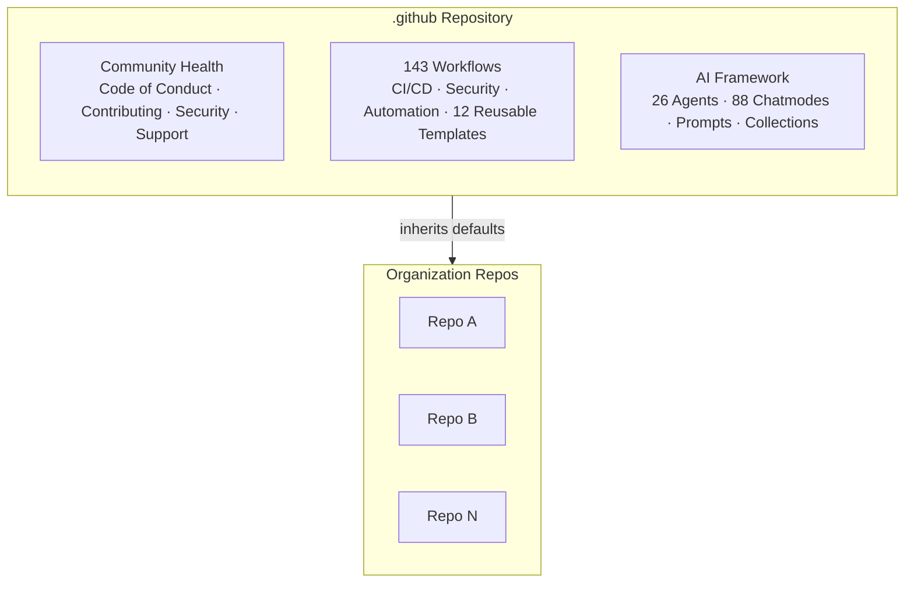

# Plan: Repository Overhaul — Badges, Deployments, and Documentation

Bring README, profile, and repo metadata up to the standard of top GitHub repositories (react, kubernetes, mermaid, astro, next.js).

---

## Phase 1: Repository Metadata (GitHub API — no file edits)

**Impact: High | Effort: 5 min**

### 1a. Set 10 Repository Topics (currently: NONE)
```bash
gh repo edit ivviiviivvi/.github --add-topic github-organization,github-actions,ai-agents,github-copilot,automation,devops,ci-cd,community-health,github-templates,developer-experience
```

### 1b. Update Repository Description
> Organization-wide CI/CD, AI agents, and community health files — 143 workflows, 26 AI agents, 88 Copilot chatmodes

### 1c. Set Homepage URL
```bash
gh repo edit ivviiviivvi/.github --homepage "https://ivviiviivvi.github.io/.github"
```

### 1d. Generate & Upload Social Preview Image
Use Socialify: `https://socialify.git.ci/ivviiviivvi/.github/image?description=1&font=Inter&language=1&name=1&owner=1&pattern=Plus&theme=Dark`
Download 1280x640 PNG → upload via Settings > Social Preview. Save copy to `docs/assets/images/social-preview.png`.

---

## Phase 2: README.md Complete Rewrite

**Impact: Very High | Effort: ~2 hrs**
**File: `README.md`**

### New Structure (replaces current 322-line README)

```
1. Centered title + one-line tagline
2. Badges (4 only: CI, License, Pre-commit, PRs Welcome)
3. "Open in Codespaces" + "View Documentation" buttons
4. One-paragraph description
5. Mermaid architecture diagram (replaces ASCII tree)
6. Quick Start (3 steps, not 5)
7. Feature highlights (3 sections: Workflows, AI Framework, Governance)
8. By the Numbers (single line, correct counts)
9. Documentation links (compact table)
10. Contributing + Security (2 short sections)
11. License (1 line)
```

### 2a. Badge Overhaul

**Remove 12 badges:**
- Language logos (JS, Python) — decorative, link to `#`
- GitHub-native stats (Stars, Issues, PRs, Last Commit, Contributors) — GitHub shows these in the sidebar
- Hardcoded stale badges (Version 1.0.0, "129 workflows", Security scanning, Documentation)

**Keep 2:**
- CI status badge
- License badge

**Add 2:**
- Pre-commit enabled (move from below markers into main line)
- PRs Welcome: `[](CONTRIBUTING.md)`

**Result: 4 badges, one row, all `flat-square`**

### 2b. Add "Open in Codespaces" Button

Repo ID: 1084954929. Devcontainer exists at `.devcontainer` (symlink → `.config/devcontainer/`).

```markdown
[](https://codespaces.new/ivviiviivvi/.github?devcontainer_path=.devcontainer/devcontainer.json)
```

### 2c. Add Mermaid Architecture Diagram

Replace ASCII file tree with a Mermaid graph showing the org inheritance model:



### 2d. Fix All Stale Numbers

| Location | Current | Correct |
|---|---|---|
| "129 workflows" (badge + text) | 129 | **143** (131 standard + 12 reusable) |
| "32 AI agents" / "32 Production AI Agents" | 32 | **26** |
| "44 Python automation scripts" (CLAUDE.md) | 44 | **57** |

Add marker comment for future automation:
```html
<!-- UPDATE_COUNTS: workflows=143 agents=26 chatmodes=88 reusable=12 scripts=57 docs=302 -->
```

### 2e. Remove Redundant Sections

- "The Problem" / "Our Approach" / "The Outcome" narrative — tagline replaces this
- "Version Management" code block — developer docs, not README
- "Dependabot" / "Stale Management" — operational details
- "Contact" emails — SUPPORT.md handles this
- "GitHub Projects" listing — discoverable from org page
- All 13 `______________________________________________________________________` horizontal rules — use heading hierarchy

### 2f. Consolidate Remaining Sections

- Templates → fold into "Organization Governance" feature highlight
- Security → 3-line section linking to SECURITY.md
- Development + Community → compact "Contributing" section

---

## Phase 3: profile/README.md Redesign

**Impact: High | Effort: 30 min**
**File: `profile/README.md`**

### New Structure
```markdown
<div align="center">
  <h1>ivviiviivvi</h1>
  <p><strong>AI-Driven Development Infrastructure for the Modern Organization</strong></p>
  <p>
    <a href=".../.github">Configuration Hub</a> ·
    <a href=".../docs/INDEX.md">Documentation</a> ·
    <a href=".../discussions">Discussions</a>
  </p>
</div>

---

One-sentence description.

| | |
|:---:|:---:|
| **143** Workflows | **26** AI Agents |
| **88** Chatmodes | **12** Reusable Templates |

### What We Ship
- Organization Automation — ...
- AI Development Agents — ...
- GitHub Copilot Customizations — ...

CI badge | License badge
```

**Key changes:** Centered header with nav links, 2x2 stats grid with correct numbers, badges at bottom.

---

## Phase 4: Badge Management Workflow Fix

**Impact: Medium | Effort: 30 min**

### 4a. Update badge-config.yml
**File: `.github/badge-config.yml`**

```yaml
include:
  ci_status: true
  license: true
  language: false   # was true
  stats: false      # was true
  docker: false     # was true
  contributors: false  # was true
```

### 4b. Fix badge-management.yml hardcoded badges
**File: `.github/workflows/badge-management.yml`** (lines 219-262)

The workflow does NOT read `include.stats` or `include.language` from config — it always generates language badges from auto-detection and always appends Stars/Issues/PRs/Last Commit/Contributors badges unconditionally.

**Fix:** Read the include flags from badge-config.yml in the `load-config` step (via `yq`), then wrap the language badge loop (lines 220-248) and stats block (lines 250-262) in conditionals:

```bash
# In load-config step, add:
INCLUDE_LANGUAGE=$(yq eval '.include.language // true' "$CONFIG_FILE")
INCLUDE_STATS=$(yq eval '.include.stats // true' "$CONFIG_FILE")
INCLUDE_CONTRIBUTORS=$(yq eval '.include.contributors // true' "$CONFIG_FILE")

# In generate-badges step, wrap language badges:
if [ "$INCLUDE_LANGUAGE" = "true" ]; then
  # ... existing language badge loop ...
fi

# Wrap stats badges:
if [ "$INCLUDE_STATS" = "true" ]; then
  BADGES="${BADGES}[![Stars]..." # etc.
fi

# Wrap contributors badge:
if [ "$INCLUDE_CONTRIBUTORS" = "true" ]; then
  BADGES="${BADGES}[![Contributors]..."
fi
```

---

## Phase 5: Stale Numbers in CLAUDE.md Files

**Impact: Medium | Effort: 15 min**

### 5a. Root CLAUDE.md
**File: `CLAUDE.md`**

| Line content | Fix |
|---|---|
| "129 GitHub Actions workflows" | → 143 |
| "32 production AI agents" | → 26 |

### 5b. docs/CLAUDE.md (extended guide)
**File: `docs/CLAUDE.md`**

| Line content | Fix |
|---|---|
| "131 GitHub Actions workflows" | → 143 |
| Architecture tree: "131 automation workflows" | → 143 |
| Architecture tree: "44 Python automation scripts" | → 57 |

---

## Phase 6: Jekyll Config Placeholders

**Impact: Low-Medium | Effort: 10 min**
**File: `docs/site/_config.yml`**

| Line | Current | Fix |
|---|---|---|
| 9 | `author: '{{ORG_AUTHOR}}'` | `author: 'ivviiviivvi'` |
| 10 | `email: support@{{ORG_DOMAIN}}` | `email: support@ivviiviivvi.com` |
| 189 | `og_image: /assets/images/og-image.png` | `og_image: /assets/images/social-preview.png` |
| 188 | `twitter_creator: '{{ORG_TWITTER}}'` | Remove or set to actual handle |

---

## Phase 7: Devcontainer Python Version

**Impact: Low | Effort: 5 min**
**File: `.config/devcontainer/devcontainer.json`**

Python version is `3.11` but CI and pyproject.toml prefer `3.12`. Bump to `"version": "3.12"` for consistency.

---

## Files Modified Summary

| File | Changes |
|---|---|
| `README.md` | Complete rewrite: 4 badges, Codespaces button, Mermaid diagram, correct numbers, remove clutter |
| `profile/README.md` | Redesign: centered layout, nav links, 2x2 stats grid, correct numbers |
| `.github/badge-config.yml` | Disable language, stats, docker, contributors |
| `.github/workflows/badge-management.yml` | Add config-driven conditionals for language/stats/contributors badges |
| `CLAUDE.md` | Fix workflow count (129→143), agent count (32→26) |
| `docs/CLAUDE.md` | Fix workflow count (131→143), script count (44→57) |
| `docs/site/_config.yml` | Replace template placeholders, fix og_image path |
| `.config/devcontainer/devcontainer.json` | Python 3.11→3.12 |
| `docs/assets/images/social-preview.png` | New file (downloaded from Socialify) |

---

## Verification

1. **Visual check:** Open `README.md` and `profile/README.md` on GitHub after push — verify Mermaid renders, badges display, Codespaces button works
2. **Codespaces test:** Click the "Open in Codespaces" button — verify it launches with correct devcontainer
3. **Badge workflow:** Run `gh workflow run "Badge Management"` — verify it no longer adds language/stats badges
4. **Link checker:** Verify new links in README don't break the lychee job
5. **SEO:** Check `github.com/ivviiviivvi/.github` shows topics, description, and homepage link
6. **Social preview:** Share repo URL on Slack/Discord to verify preview image renders
