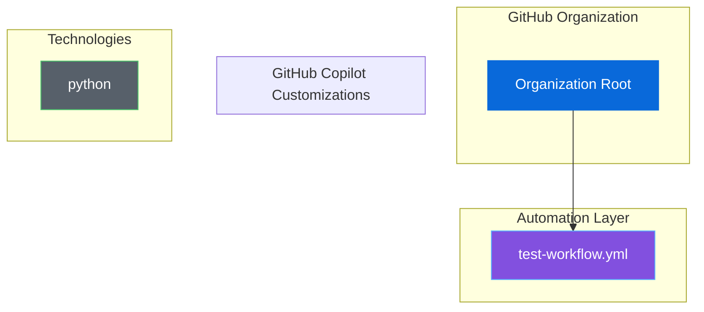

# 🎯 Organization Ecosystem Dashboard

**Last Updated**: December 25, 2025 at 02:37 AM
**Organization**: TestOrg

---

## 📋 Table of Contents

- [Quick Stats](#-quick-stats)
- [Repository Health](#-repository-health)
- [Link Health](#-link-health)
- [Alerts](#-alerts)
- [Ecosystem Map](#-ecosystem-map)
- [Technology Coverage](#-technology-coverage)
- [Active Workflows](#-active-workflows)

---

## 📊 Quick Stats

| Category | Count |
|----------|-------|
| ⚡ GitHub Actions Workflows | 1 |
| 🤖 Copilot Agents | 0 |
| 📝 Copilot Instructions | 0 |
| 💬 Copilot Prompts | 0 |
| 🎭 Copilot Chat Modes | 0 |
| 🛠️  Technologies Supported | 1 |

[Back to Top](#organization-ecosystem-dashboard)

## ⚠️  Alerts

✅ No alerts found! The ecosystem is healthy.

[Back to Top](#organization-ecosystem-dashboard)

## 🗺️  Ecosystem Map

[Back to Top](#organization-ecosystem-dashboard)

## 🛠️  Technology Coverage

Supported languages and frameworks:

View all 1 technologies

| `python` |  |  |  |
| --- | --- | --- | --- |

[Back to Top](#organization-ecosystem-dashboard)

## ⚙️  Active Workflows

View all 1 workflows

- [`test-workflow.yml`](../.github/workflows/test-workflow.yml)

[Back to Top](#organization-ecosystem-dashboard)

---

*Dashboard generated by Ecosystem Visualizer*
