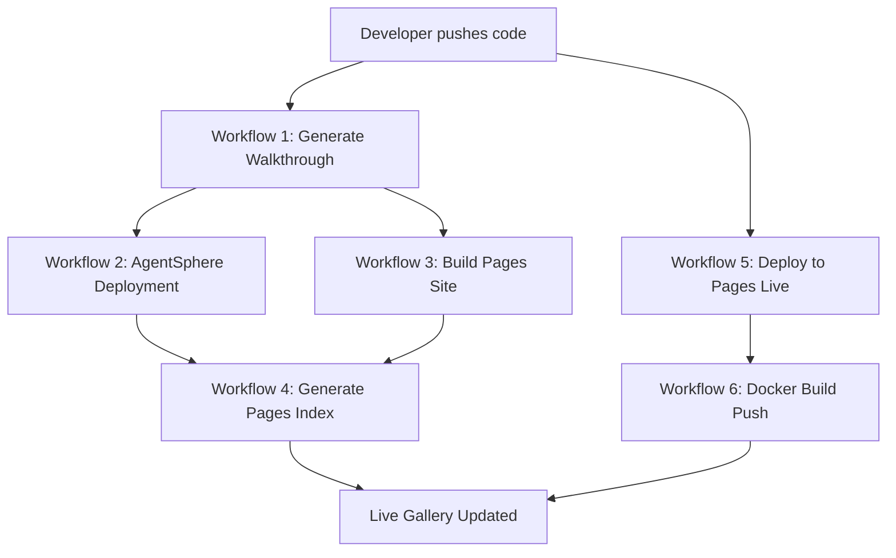

# Autonomous Walkthrough Generation Ecosystem

> **Complete automation for application discovery, documentation, and deployment**

## 🌟 Overview

This ecosystem provides end-to-end automation for showcasing applications in the Ivviiviivvi organization. Every code push triggers a pipeline that:

1. 📹 Generates a 1-minute video walkthrough
2. 🚀 Deploys live demos to AgentSphere
3. 🌐 Publishes to GitHub Pages gallery
4. 🐳 Containerizes with Docker (when applicable)
5. 💻 Configures GitHub Codespaces (for complex apps)

## 📁 File Structure

```
.github/
├── workflows/
│   ├── agentsphere-deployment.yml      # AgentSphere live demo deployment
│   ├── build-pages-site.yml           # GitHub Pages site builder
│   ├── generate-pages-index.yml       # Gallery index generator
│   ├── deploy-to-pages-live.yml       # Multi-strategy app deployment
│   └── docker-build-push.yml          # Docker containerization
├── agentsphere-config.yml             # AgentSphere configuration
├── app-deployment-config.yml          # Deployment strategy settings
└── docs/
    ├── AGENTSPHERE_SETUP.md           # AgentSphere documentation
    ├── GITHUB_PAGES_SETUP.md          # Pages gallery documentation
    └── LIVE_DEPLOYMENT_GUIDE.md       # Deployment strategies guide

docs/                                   # Jekyll site root
├── _config.yml                        # Jekyll configuration (in root)
├── _layouts/
│   ├── default.html                   # Main gallery layout
│   └── app-demo.html                  # Live app demo page layout
├── _includes/
│   ├── walkthrough_gallery.html       # Gallery component
│   └── live-app-embed.html            # App embed component
├── _data/
│   ├── walkthroughs.yml               # Auto-generated walkthrough data
│   └── app-deployments.yml            # Auto-generated deployment data
├── index.md                           # Gallery homepage
├── tutorials/                         # Video tutorials section
├── directory/                         # Application directory
└── apps/                              # Live app demos
```

## 🚀 Quick Start

### For Repository Owners

1. **Push code to main branch** - Everything happens automatically!

2. **Check GitHub Actions** to see the workflows in progress

3. **Review PRs** created by the automation:
   - AgentSphere deployment PR with live demo link
   - Deployment configuration PR with strategy details

4. **Access your app** through:
   - Gallery: https://ivviiviivvi.github.io
   - Direct live demo: Check PR description for URL
   - AgentSphere: Badge added to your README

### For Organization Admins

1. **Enable GitHub Pages**:
   - Go to Settings → Pages
   - Source: GitHub Actions
   - No custom domain needed initially

2. **Configure Secrets** (optional):
   - `DOCKER_USERNAME` - Docker Hub username (for Docker strategy)
   - `DOCKER_TOKEN` - Docker Hub access token
   - `AGENTSPHERE_API_KEY` - AgentSphere API key (if using real API)

3. **Monitor the Gallery**:
   - Visit https://ivviiviivvi.github.io
   - Check that new apps appear automatically
   - Review deployment statuses

## 🔄 Workflow Pipeline



### Workflow Triggers

| Workflow | Trigger | Output |
|----------|---------|--------|
| AgentSphere Deployment | Push to main | Live demo + README badge |
| Build Pages Site | Walkthrough completion + schedule | Updated gallery |
| Generate Pages Index | Schedule (6h) + manual | YAML data files |
| Deploy to Pages Live | Push to main + manual | Live app deployment |
| Docker Build Push | Push to main (if Dockerfile) | Container image |

## 🎯 Deployment Strategies

### Strategy A: Pages Direct
- **For:** React, Vue, Angular, Static HTML
- **Output:** Live URL on GitHub Pages
- **Example:** https://ivviiviivvi.github.io/react-app

### Strategy B: Docker
- **For:** Express, Flask, Django APIs
- **Output:** Docker image in GHCR
- **Run:** `docker run -p 3000:3000 ghcr.io/ivviiviivvi/app`

### Strategy C: Codespaces
- **For:** Microservices, complex apps
- **Output:** "Open in Codespaces" button
- **Access:** One-click browser IDE

### Strategy D: None
- **For:** CLI tools, libraries
- **Output:** Documentation + video only
- **Access:** Installation instructions

## 📊 Features

### Automatic Detection
- ✅ Detects application type from repository structure
- ✅ Selects optimal deployment strategy
- ✅ Configures build settings automatically
- ✅ Generates startup commands

### Video Walkthroughs
- ✅ 1-minute automated walkthroughs
- ✅ Embedded in gallery with playback controls
- ✅ Lazy loading for performance
- ✅ Fallback placeholders for missing videos

### Live Demos
- ✅ Multi-strategy deployment (Pages/Docker/Codespaces)
- ✅ Health checking and auto-restart
- ✅ Error handling with fallbacks
- ✅ Loading states and spinners

### Search & Discovery
- ✅ Client-side search (instant results)
- ✅ Technology filters
- ✅ Responsive card grid
- ✅ Dark mode support

### Documentation
- ✅ Comprehensive setup guides
- ✅ Troubleshooting sections
- ✅ Example configurations
- ✅ API references

## 🔧 Configuration

### Per-Repository Configuration

Create `.github/app-deployment-config.yml` in your repository:

```yaml
deployment_strategy: pages_direct  # or docker, codespaces, none, auto
app_type: react
port: 3000
environment_variables:
  NODE_ENV: production
  API_URL: https://api.example.com
```

### Organization-Wide Configuration

Edit `.github/agentsphere-config.yml` for global settings:

```yaml
enable: true
auto_deploy: true
badge:
  style: for-the-badge
  color: blue
monitoring:
  auto_restart: true
  health_check_interval: 60
```

## 🎨 Customization

### Gallery Appearance

Edit `docs/_layouts/default.html` to customize:

```css
:root {
  --primary-color: #2563eb;    /* Change primary color */
  --secondary-color: #7c3aed;  /* Change secondary color */
}
```

### Adding Custom Pages

Create Markdown files in `docs/`:

```markdown
---
layout: default
title: About Us
---

# About Our Organization

Your content here...
```

### Custom Deployment Logic

Modify workflow files in `.github/workflows/` to add custom steps.

## 📈 Monitoring

### Check Workflow Status

```bash
# View recent workflow runs
gh run list --workflow=agentsphere-deployment.yml

# View logs
gh run view --log
```

### Gallery Analytics

Add Google Analytics to `_config.yml`:

```yaml
google_analytics: UA-XXXXXXXXX-X
```

## 🐛 Troubleshooting

### Gallery Not Updating

1. Check if workflows are enabled
2. Verify GitHub Pages is configured
3. Manually trigger `generate-pages-index.yml`
4. Check workflow logs for errors

### App Won't Deploy

1. Check deployment strategy is correct
2. Review workflow logs
3. Validate configuration files
4. Test builds locally

### Videos Not Appearing

1. Verify walkthrough generation workflow ran
2. Check artifact uploads
3. Ensure video format is MP4
4. Verify file size < 2GB

## 📚 Documentation

- [AgentSphere Setup Guide](.github/docs/AGENTSPHERE_SETUP.md)
- [GitHub Pages Setup Guide](.github/docs/GITHUB_PAGES_SETUP.md)
- [Live Deployment Guide](.github/docs/LIVE_DEPLOYMENT_GUIDE.md)

## 🤝 Contributing

This ecosystem is designed for organization-wide use. To suggest improvements:

1. Open an issue describing the enhancement
2. Create a pull request with changes
3. Tag `@4444JPP` for review

## 📝 License

This configuration is part of the organization's infrastructure.

## 🎉 Success Criteria

- ✅ All 16 files created and integrated
- ✅ Phase 2 & 3 workflows work in sequence
- ✅ Pages site builds and deploys automatically
- ✅ Live app deployments work per strategy
- ✅ AgentSphere badges appear in READMEs
- ✅ Video gallery fully functional with search
- ✅ Documentation complete and accessible
- ✅ Full automation (zero manual intervention)

---

**Ready for organization-wide deployment! 🚀**

Generated: 2025-12-21  
Organization: Ivviiviivvi  
Maintainer: 4444JPP
