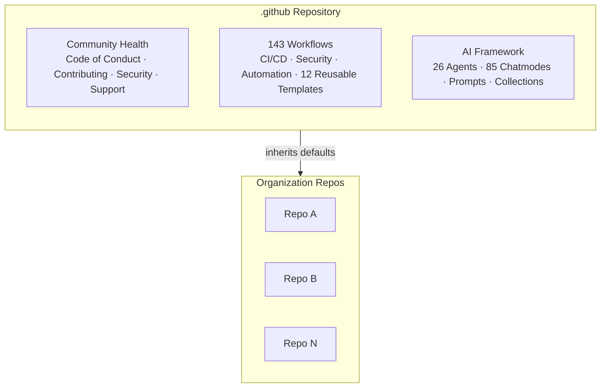

<div align="center">

# .github

**Organization-wide infrastructure for CI/CD, AI agents, and community health**

<!-- BADGES:START -->

[](https://github.com/ivviiviivvi/.github/actions/workflows/ci.yml)
[](LICENSE)
[](https://github.com/pre-commit/pre-commit)
[](CONTRIBUTING.md)

<!-- BADGES:END -->

[](https://codespaces.new/ivviiviivvi/.github?devcontainer_path=.devcontainer/devcontainer.json)

[Documentation](docs/INDEX.md) | [Contributing](CONTRIBUTING.md) | [Security](SECURITY.md)

</div>

This is the **organization-level `.github` repository** for ivviiviivvi. Files here — workflows, templates, governance docs — are automatically inherited by every repository in the organization that doesn't define its own.

<!-- UPDATE_COUNTS: workflows=143 agents=26 chatmodes=85 reusable=12 scripts=57 -->



## Quick Start

```bash
git clone https://github.com/ivviiviivvi/.github.git
cd .github
pip install -e ".[dev]"
pre-commit install
```

Need help? Check [SUPPORT.md](SUPPORT.md) or [start a discussion](https://github.com/orgs/ivviiviivvi/discussions).

## Workflows

**143 workflows** covering CI/CD pipelines, security scanning (CodeQL, Gitleaks, TruffleHog), PR automation, health monitoring, and metrics. All actions are [SHA-pinned](https://docs.github.com/en/actions/security-for-github-actions/security-guides/security-hardening-for-github-actions#using-third-party-actions) with ratchet comments.

Key workflows: `ci.yml` · `codeql-analysis.yml` · `auto-merge.yml` · `health-check.yml` · `batch-onboarding.yml`

See the [Workflow Registry](docs/registry/) for the full catalog.

## AI Framework

**26 production agents** across security, infrastructure, development, languages, and documentation. **85 chatmodes** for specialized AI personas. Plus coding instructions, task prompts, and curated collections — all compatible with GitHub Copilot.

- [Agent Registry](docs/reference/AGENT_REGISTRY.md)
- [Copilot Quick Start](docs/guides/COPILOT_QUICK_START.md)

## Organization Governance

Default community health files inherited by all org repos:

| File | Purpose |
|---|---|
| [CODE_OF_CONDUCT.md](CODE_OF_CONDUCT.md) | Community standards |
| [CONTRIBUTING.md](CONTRIBUTING.md) | Contribution guidelines |
| [SECURITY.md](SECURITY.md) | Vulnerability reporting |
| [SUPPORT.md](SUPPORT.md) | Getting help |

Issue templates, PR templates, and workflow templates are also provided for bootstrapping new repositories.

## Documentation

| Resource | Description |
|---|---|
| [Documentation Index](docs/INDEX.md) | Browse all docs |
| [Development Environment](docs/guides/DEVELOPMENT_ENVIRONMENT_SETUP.md) | Setup guide |
| [Workflow Design](docs/workflows/WORKFLOW_DESIGN.md) | Architecture |
| [Claude Code Guide](docs/guides/CLAUDE.md) | AI assistant reference |

## Contributing

We welcome contributions. Please read [CONTRIBUTING.md](CONTRIBUTING.md) for guidelines, including our [conventional commit](https://www.conventionalcommits.org/) requirement (`type(scope): subject`).

## Security

Found a vulnerability? **Do not open a public issue.** Follow our [Security Policy](SECURITY.md) or use [GitHub Security Advisories](https://github.com/ivviiviivvi/.github/security/advisories/new).

## License

[MIT](LICENSE)
