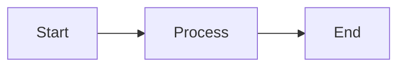

# Organization Style Guide

Comprehensive style guide for documentation, communication, and content creation across the organization.

## Table of Contents

- [Overview](#overview)
- [Language and Grammar](#language-and-grammar)
- [Punctuation](#punctuation)
- [Formatting](#formatting)
- [Markdown Conventions](#markdown-conventions)
- [Code Documentation](#code-documentation)
- [Tone and Voice](#tone-and-voice)
- [Technical Writing](#technical-writing)
- [Common Patterns](#common-patterns)
- [Terms and Terminology](#terms-and-terminology)
- [Visual Elements](#visual-elements)
- [Accessibility](#accessibility)

---

## Overview

This style guide establishes consistent standards for all written content in the organization. Following these guidelines ensures clarity, professionalism, and accessibility.

### Core Principles

1. **Clarity**: Write clearly and concisely
2. **Consistency**: Apply standards uniformly
3. **Accuracy**: Ensure technical precision
4. **Accessibility**: Make content accessible to all
5. **Professionalism**: Maintain professional tone
6. **No Emoji**: Avoid emoji in professional documentation

---

## Language and Grammar

### American English

Use American English spelling and conventions:

**Correct**:
- color (not colour)
- organize (not organise)
- center (not centre)
- analyze (not analyse)
- program (not programme)

### Capitalization

**Title Case for Headings**:
```markdown
# Getting Started with GitHub Actions
## Setting Up Your Environment
```

**Sentence Case for Lists**:
- First item in the list
- Second item in the list

**Proper Nouns**:
Always capitalize:
- GitHub (not Github or github)
- JavaScript (not Javascript)
- TypeScript (not Typescript)
- Python (capitalize in prose, lowercase in code)
- Docker (not docker in prose)

**Acronyms**:
- API (not Api or api in prose)
- CI/CD (not ci/cd in prose)
- JSON (not Json)
- HTML (not Html)
- CSS (not Css)

### Tense and Voice

**Active Voice** (preferred):
```
The function returns a value.
```

**Passive Voice** (avoid when possible):
```
A value is returned by the function.
```

**Present Tense**:
```
The system validates user input.
```

**Imperative for Instructions**:
```
Run the command.
Install the package.
Configure the settings.
```

### Person

**Second Person for Instructions**:
```
You can configure the settings by...
```

**First Person Plural for Inclusive Language**:
```
We recommend using...
Let's explore how...
```

**Avoid First Person Singular**:
```
Wrong: I recommend...
Right: We recommend...
```

### Articles

Use articles (a, an, the) appropriately:

**Indefinite Articles (a, an)**:
```
a user
an API
a GitHub repository
an HTTP request
```

**Definite Article (the)**:
```
the database
the configuration file
the main branch
```

### Pronouns

**Gender-Neutral Language**:
```
Wrong: A user must enter his password.
Right: A user must enter their password.
Right: Users must enter their passwords.
```

### Verb Agreement

**Subject-Verb Agreement**:
```
The function returns a value. (singular)
The functions return values. (plural)
```

**Collective Nouns**:
```
The team is working on the project. (singular)
The team members are working on the project. (plural)
```

---

## Punctuation

### Commas

**Serial Comma (Oxford Comma)**:
Always use the serial comma in lists:
```
We support Python, JavaScript, and Go.
```

**Comma Splices**:
Avoid comma splices (two independent clauses joined by comma):
```
Wrong: The code is ready, we can deploy it.
Right: The code is ready, so we can deploy it.
Right: The code is ready; we can deploy it.
Right: The code is ready. We can deploy it.
```

### Semicolons

**Between Independent Clauses**:
```
The feature is complete; testing begins tomorrow.
```

**In Complex Lists**:
```
The system supports Python 3.8, 3.9, and 3.10; Node.js 16, 18, and 20; and Go 1.19 and later.
```

### Colons

**Introducing Lists**:
```
The following languages are supported:
- Python
- JavaScript
- Go
```

**Explanatory Clauses**:
```
The solution is simple: use caching.
```

### Hyphens and Dashes

**Hyphen (-)** for compound words:
```
open-source software
well-known feature
up-to-date documentation
```

**En Dash (–)** for ranges:
```
2020–2024
versions 1.0–2.0
```

**Em Dash (—)** for parenthetical statements:
```
The feature—released yesterday—improves performance.
```

### Quotation Marks

**Double Quotes for Quotations**:
```
The documentation states: "Always use semantic versioning."
```

**Code Elements**:
Use backticks for inline code, not quotes:
```
Wrong: Use the "git commit" command.
Right: Use the `git commit` command.
```

### Apostrophes

**Possessives**:
```
the user's data
the system's configuration
James's repository (or James')
```

**Contractions** (avoid in formal documentation):
```
Informal: don't, can't, won't
Formal: do not, cannot, will not
```

### Ellipsis

**Use Three Dots** (...):
```
The process continues...
```

**With Space Before and After**:
```
The function accepts parameters ... and returns a value.
```

---

## Formatting

### Emphasis

**Bold** for UI elements and important terms:
```markdown
Click the **Save** button.
The **API key** is required.
```

**Italic** for emphasis and new terms:
```markdown
This is *extremely* important.
The system uses *lazy loading* to improve performance.
```

**Code Font** for code elements:
```markdown
The `git commit` command creates a commit.
Set the `debug` parameter to `true`.
```

### Lists

**Unordered Lists**:
```markdown
- First item
- Second item
- Third item
```

**Ordered Lists**:
```markdown
1. First step
2. Second step
3. Third step
```

**Nested Lists**:
```markdown
- Main item
  - Sub-item
  - Another sub-item
- Another main item
```

**List Punctuation**:
- No period if items are fragments
- Period if items are complete sentences
- Consistent within each list

### Tables

**Clear Headers**:
```markdown
| Column 1 | Column 2 | Column 3 |
|----------|----------|----------|
| Data 1   | Data 2   | Data 3   |
```

**Alignment**:
```markdown
| Left | Center | Right |
|:-----|:------:|------:|
| L1   |   C1   |    R1 |
```

---

## Markdown Conventions

### Headings

**Hierarchy**:
```markdown
# Document Title (H1)
## Main Section (H2)
### Subsection (H3)
#### Sub-subsection (H4)
```

**Heading Levels**:
- Use only one H1 per document
- Don't skip levels (H1 → H3)
- Keep headings descriptive

**Heading Format**:
```markdown
## Heading with Multiple Words
```

### Links

**Inline Links**:
```markdown
See the [documentation](https://example.com).
```

**Reference Links**:
```markdown
See the [documentation][docs].

[docs]: https://example.com
```

**Absolute vs Relative**:
```markdown
Absolute: [External](https://example.com)
Relative: [Internal](./other-doc.md)
```

### Code Blocks

**Fenced Code Blocks**:
````markdown
```python
def hello():
    print("Hello, world!")
```
````

**Language Identifier**:
Always specify the language:
````markdown
```javascript
```python
```bash
```yaml
```json
````

**Inline Code**:
```markdown
Use the `git status` command.
```

### Blockquotes

```markdown
> This is a blockquote.
> It can span multiple lines.
```

### Horizontal Rules

```markdown
---
```

### Images

```markdown

```

Always include descriptive alt text for accessibility.

---

## Code Documentation

### Comments

**Single-Line Comments**:
```python
# This is a comment
```

**Multi-Line Comments**:
```python
"""
This is a multi-line comment
that spans multiple lines.
"""
```

**Docstrings**:

Python:
```python
def function_name(param1, param2):
    """
    Brief description of function.

    Args:
        param1: Description of param1
        param2: Description of param2

    Returns:
        Description of return value

    Raises:
        ExceptionType: When this exception is raised
    """
    pass
```

JavaScript:
```javascript
/**
 * Brief description of function.
 *
 * @param {string} param1 - Description of param1
 * @param {number} param2 - Description of param2
 * @returns {boolean} Description of return value
 */
function functionName(param1, param2) {
    // Implementation
}
```

### Variable Names

**Descriptive Names**:
```python
# Good
user_count = 10
total_price = 99.99

# Bad
uc = 10
tp = 99.99
```

**Naming Conventions**:
- Python: `snake_case`
- JavaScript: `camelCase`
- Constants: `UPPER_CASE`
- Classes: `PascalCase`

### Function Documentation

Include:
- Purpose
- Parameters
- Return values
- Side effects
- Exceptions
- Examples

---

## Tone and Voice

### Professional Tone

**Formal but Approachable**:
```
We recommend using semantic versioning for all releases.
```

**Avoid Overly Casual**:
```
Wrong: This feature is super cool!
Right: This feature provides significant benefits.
```

### Clarity and Simplicity

**Short Sentences**:
```
Good: The system validates input. Then it processes the request.
Avoid: The system validates input and then it processes the request which may take several seconds depending on the complexity of the data being submitted.
```

**Simple Words**:
```
Use: use (not utilize)
Use: help (not facilitate)
Use: need (not require)
Use: show (not demonstrate)
```

### Inclusive Language

**Avoid Gendered Language**:
```
Wrong: man-hours
Right: work hours, person-hours

Wrong: chairman
Right: chair, chairperson
```

**Avoid Ableist Language**:
```
Wrong: The blind spot in this approach
Right: The oversight in this approach

Wrong: This is insane
Right: This is unusual, unexpected
```

---

## Technical Writing

### Prerequisites

**State Requirements Clearly**:
```markdown
## Prerequisites

Before you begin, ensure you have:
- Python 3.8 or later
- Git installed
- A GitHub account
```

### Instructions

**Step-by-Step Format**:
```markdown
1. Clone the repository
2. Install dependencies
3. Run the application
```

**Numbered for Sequential Steps**:
Use numbered lists when order matters.

**Bulleted for Non-Sequential Items**:
Use bullet points when order doesn't matter.

### Examples

**Include Complete Examples**:

When documenting examples, include complete working code:

Example:
```bash
git clone https://github.com/user/repo.git
cd repo
npm install
npm start
```

### Warnings and Notes

**Format Consistently**:
```markdown
**Note**: This is important information.

**Warning**: This action cannot be undone.

**Tip**: This will save you time.
```

---

## Common Patterns

### File Paths

**Use Code Formatting**:
```markdown
Edit the `config/settings.yaml` file.
Navigate to the `/usr/local/bin` directory.
```

**Path Separators**:
Use forward slashes (/) even for Windows:
```
config/settings.yaml
src/components/Button.js
```

### Commands

**Format as Code Blocks**:

When documenting commands, format them as code blocks with the appropriate language identifier:

```bash
npm install
```

**Include Shell Prompt Carefully**:
```bash
# With prompt (shows context)
$ npm install

# Without prompt (easier to copy)
npm install
```

### Environment Variables

**All Caps**:
```markdown
Set the `API_KEY` environment variable.
```

### Versions

**Semantic Versioning**:
```
v1.2.3
version 1.2.3
```

**Version Ranges**:
```
Python 3.8 or later
Node.js 16, 18, or 20
```

---

## Terms and Terminology

### Standardized Terms

**Repository Terms**:
- repository (not repo in formal docs)
- pull request (not PR in formal docs)
- commit (not checkin)
- branch (not line)
- merge (not integrate)

**Git Commands**:
- `git clone` (not "clone a repo")
- `git commit` (not "commit changes")
- `git push` (not "push code")

**GitHub Terms**:
- GitHub Actions (not "actions")
- GitHub Pages (not "pages")
- GitHub Releases (not "releases")

**Technical Terms**:
- API (application programming interface)
- CI/CD (continuous integration/continuous deployment)
- JSON (JavaScript Object Notation)
- YAML (YAML Ain't Markup Language)
- URL (uniform resource locator)

### Abbreviations

**First Use**:
```
Continuous Integration/Continuous Deployment (CI/CD)
```

**Subsequent Uses**:
```
CI/CD
```

**Common Abbreviations**:
- API (don't spell out after first use)
- URL (don't spell out)
- HTTP (don't spell out)
- JSON (don't spell out)

---

## Visual Elements

### No Emoji Policy

**Avoid Emoji in Documentation**:

Examples of what to avoid:
```
Wrong: ## 🚀 Features (emoji in header)
Right: ## Features

Wrong: ✅ Completed (emoji as indicator)
Right: [x] Completed or "completed"

Wrong: 🐛 Bug fix (emoji as label)
Right: Bug fix
```

**Use Text Alternatives**:
- Instead of visual check marks: [x] or "completed"
- Instead of warning symbols: "Warning" or "Note"
- Instead of decorative stars: "Important" or "Highlight"

### Symbols and Icons

**Acceptable Symbols**:
- Checkmarks: `[x]` or `- [x]`
- Crosses: `[ ]` or `- [ ]`
- Bullets: `-`, `*`, or `•`
- Arrows: `→`, `<-`, `=>`

### Diagrams

**ASCII Diagrams**:
```
main
  ├── develop
  │   ├── feature/login
  │   └── feature/signup
  └── hotfix/security
```

**Mermaid Diagrams**:
````markdown

````

---

## Accessibility

### Alt Text

**Descriptive Alt Text**:
```markdown

```

**Avoid**:
```markdown


```

### Link Text

**Descriptive Links**:
```
Read the [installation guide](link).
```

**Avoid**:
```
Click [here](link).
Read more [here](link).
```

### Color

**Don't Rely on Color Alone**:
Use text labels in addition to color coding.

### Headings

**Logical Structure**:
Use heading levels in order (H1 → H2 → H3).

### Tables

**Headers**:
Always include table headers for accessibility.

---

## Placeholders and Templates

### Placeholder Notation

When documenting templates or patterns that require user input, use square brackets:

```
[placeholder-name]
[version-identifier]
[feature-description]
```

**Examples**:
```markdown
Branch format: [lifecycle-phase]/[type]/[description]
Tag format: v[MAJOR].[MINOR].[PATCH]
Archive: archive/[version-identifier]
```

**In Use**:
```markdown
Template: development/feature/[feature-name]
Actual: development/feature/user-authentication
```

**Clarification Note**:
Always include a note explaining that square brackets are placeholders:
```markdown
**Note**: Square brackets indicate placeholders - replace with actual values.
```

---

## File Naming

### Case Conventions

**Files**:
- `kebab-case.md` for documentation
- `snake_case.py` for Python
- `camelCase.js` for JavaScript
- `PascalCase.tsx` for React components

**Directories**:
- `lowercase` or `kebab-case`

### Extensions

**Standard Extensions**:
- `.md` for Markdown
- `.txt` for text files
- `.yml` or `.yaml` for YAML
- `.json` for JSON

---

## Review Checklist

Before publishing documentation:

- [ ] Spelling and grammar checked
- [ ] No emoji used
- [ ] Headings follow hierarchy
- [ ] Links are valid
- [ ] Code blocks have language identifiers
- [ ] Images have alt text
- [ ] Consistent terminology used
- [ ] Active voice preferred
- [ ] Professional tone maintained
- [ ] Examples are complete and accurate
- [ ] File names follow conventions
- [ ] Formatting is consistent

---

## Revision History

Document changes to this style guide:

**Version 1.0.0** (2024-11-25):
- Initial release
- Established core principles
- Defined language and grammar standards
- Created markdown conventions
- Set no-emoji policy

---

**Last Updated**: 2024-11-25
