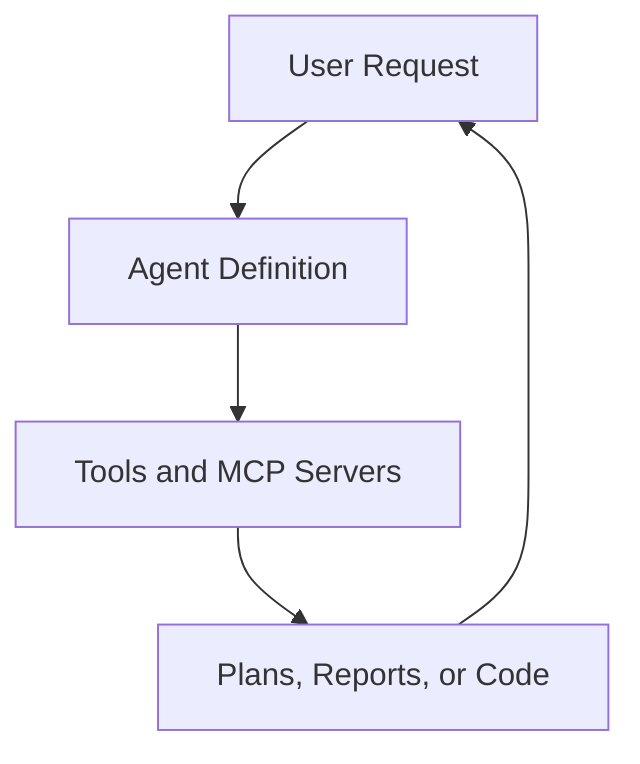

# Agents

Agent definitions used for specialized workflows.

## Contents

- Count: 26 files
- Schema: `ai_framework/agents/SCHEMA.md`
- Inventory: `ai_framework/agents/INVENTORY.md` (generated)
- Diagrams: `ai_framework/agents/DIAGRAMS.md`
- Lifecycle: `ai_framework/agents/LIFECYCLE.md`
- Full catalog: `docs/README.agents.md`
- Inventory: `ai_framework/agents/INVENTORY.md`
- Schema: `ai_framework/agents/SCHEMA.md`
- Development guide: `ai_framework/agents/DEVELOPMENT_GUIDE.md`

## Notes

- Keep frontmatter consistent across agent files.

## Interaction Diagram

