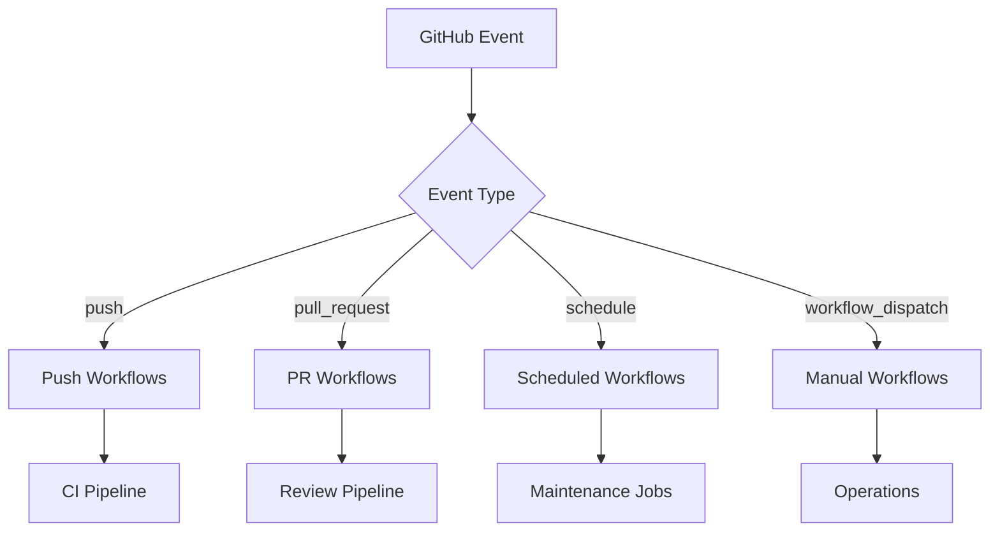
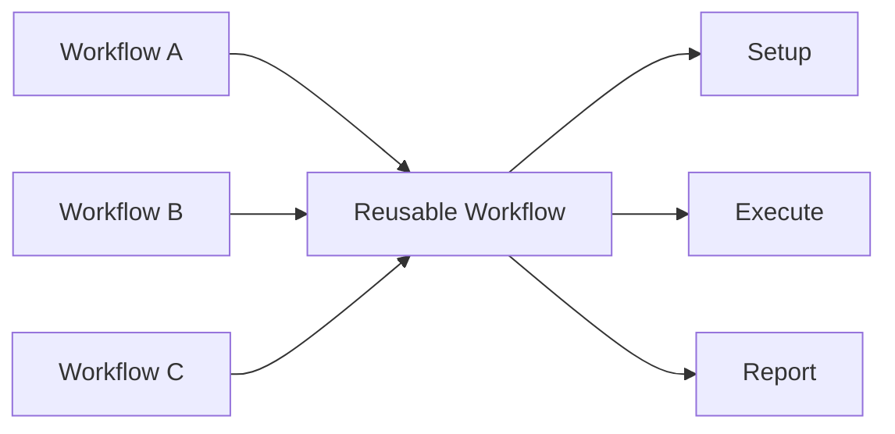
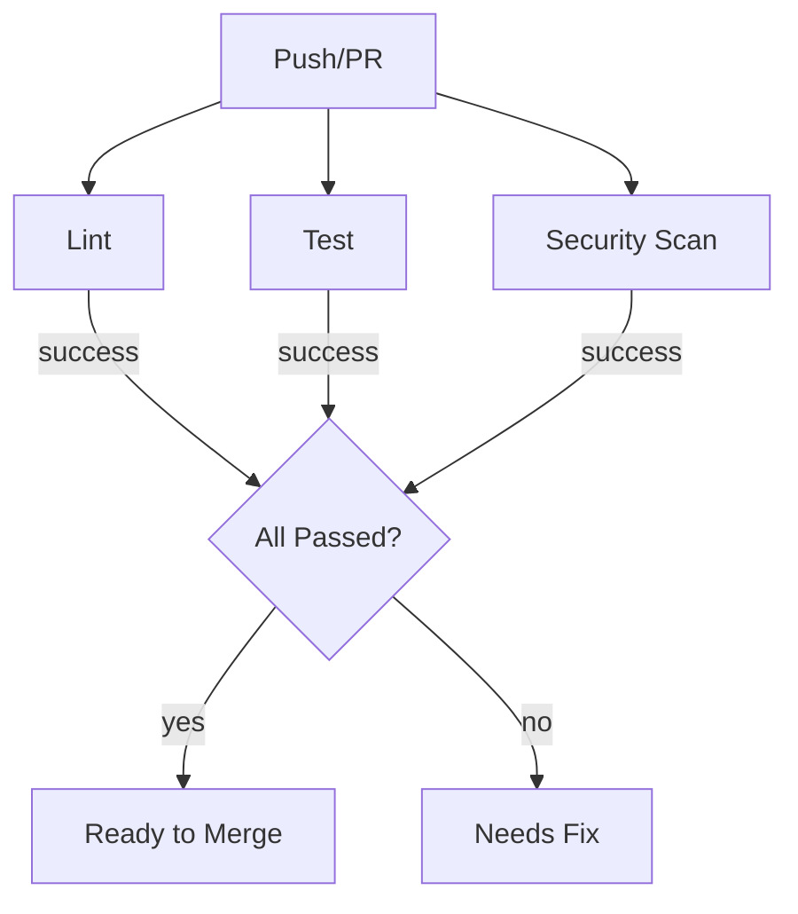
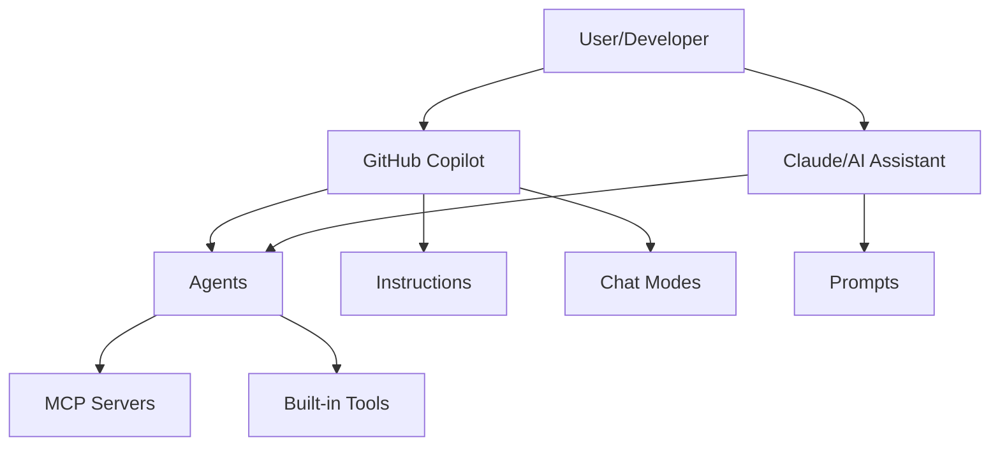
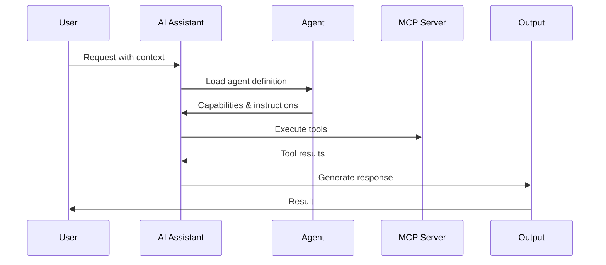
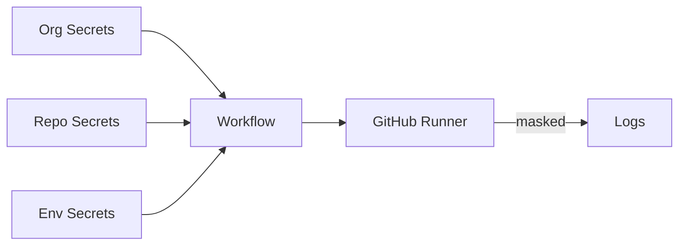
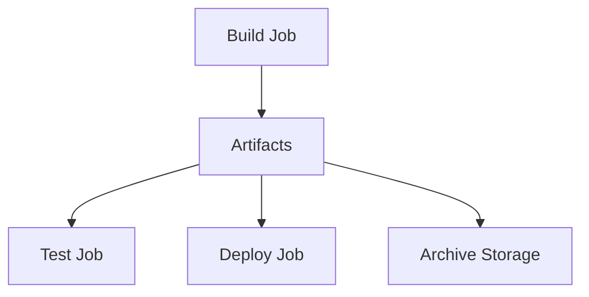

# Architecture Overview

System architecture and design principles for the {{ORG_NAME}} GitHub template.

______________________________________________________________________

## Repository Purpose

This is an **organization-level `.github` repository** that provides:

- **Default community health files** inherited by all org repositories
- **130+ GitHub Actions workflows** for automation
- **26+ production AI agents** for specialized tasks
- **GitHub Copilot customizations** (instructions, prompts, chatmodes)
- **Shared automation scripts** and utilities

______________________________________________________________________

## Directory Structure

```
.github/
├── .config/                    # ALL configuration files
│   ├── devcontainer/           # Devcontainer settings
│   ├── vscode/                 # VS Code workspace settings
│   ├── jules/                  # Jules AI configuration
│   └── pre-commit*.yaml        # Pre-commit hook configs
│
├── .github/                    # GitHub-specific files
│   ├── workflows/              # 130+ automation workflows
│   │   └── reusable/           # 6 reusable workflow templates
│   ├── ISSUE_TEMPLATE/         # Issue templates
│   ├── PULL_REQUEST_TEMPLATE.md
│   └── dependabot.yml
│
├── docs/                       # ALL documentation (300+ files)
│   ├── getting-started/        # Quick start, config, customization
│   ├── guides/                 # How-to guides
│   ├── architecture/           # System design (this file)
│   ├── reference/              # Labels, registries, catalogs
│   ├── governance/             # Policies, code of conduct
│   ├── runbooks/               # Operational procedures
│   ├── reports/                # Status reports
│   └── registry/               # Workflow registry
│
├── src/
│   ├── ai_framework/           # AI/Copilot customizations
│   │   ├── agents/             # 26+ production AI agents
│   │   ├── chatmodes/          # Copilot chat modes
│   │   ├── instructions/       # 100+ coding instructions
│   │   ├── prompts/            # Task-specific prompts
│   │   └── collections/        # Grouped resources
│   │
│   └── automation/             # Python automation
│       ├── scripts/            # 44 automation scripts
│       │   └── utils/          # Utility scripts
│       └── project_meta/       # Project metadata
│
├── tests/                      # Test suite
│   ├── unit/                   # Unit tests
│   └── integration/            # Integration tests
│
├── CLAUDE.md                   # AI assistant context
├── README.md                   # Repository overview
├── pyproject.toml              # Python configuration
└── package.json                # Node.js configuration
```

______________________________________________________________________

## Design Principles

### 1. Configuration Centralization

All configuration files live in `.config/`:

```
.config/
├── devcontainer/       # Development containers
├── vscode/             # Editor settings
├── pre-commit.yaml     # Main pre-commit config
└── pre-commit-rapid.yaml # Fast pre-commit subset
```

Root symlinks point to configs:

- `.pre-commit-config.yaml` -> `.config/pre-commit.yaml`

### 2. Documentation First

All documentation resides in `docs/`:

- Organized by purpose (guides, reference, architecture)
- Symlinks from `docs/ai_framework/` to `src/ai_framework/`
- Generated documentation alongside hand-written content

### 3. Separation of Concerns

```
Source Code:     src/
Tests:           tests/
Documentation:   docs/
Configuration:   .config/
Workflows:       .github/workflows/
```

### 4. Inheritance Model

As an organization `.github` repository:

| File                 | Inheritance                |
| -------------------- | -------------------------- |
| `CODE_OF_CONDUCT.md` | Inherited by all org repos |
| `CONTRIBUTING.md`    | Inherited by all org repos |
| `SECURITY.md`        | Inherited by all org repos |
| `FUNDING.yml`        | Inherited by all org repos |
| Issue/PR templates   | Inherited by all org repos |

______________________________________________________________________

## Layer Classification

Workflows are classified into layers based on their role:

### Core Layer

Foundation workflows that others depend on:

```yaml
# Examples
ci.yml
release.yml
reusable/*.yml
```

- Always SHA-pinned
- Minimal external dependencies
- High stability requirements

### Interface Layer

User-facing workflows:

```yaml
# Examples
welcome.yml
auto-labeler.yml
issue-triage.yml
```

- Interact with users
- Generate notifications
- Create visible artifacts

### Logic Layer

Validation and processing workflows:

```yaml
# Examples
pr-quality-checks.yml
dependency-review.yml
security-scan.yml
```

- Enforce policies
- Validate inputs
- Make pass/fail decisions

### Application Layer

Deployment and release workflows:

```yaml
# Examples
deployment.yml
release.yml
deploy-to-pages-live.yml
```

- Make changes to production
- Require approvals
- Have rollback capabilities

______________________________________________________________________

## Workflow Architecture

### Trigger Flow



### Reusable Workflow Pattern



### CI Pipeline Flow



______________________________________________________________________

## AI Framework Architecture

### Component Overview



### Agent Invocation Flow



______________________________________________________________________

## Data Flow

### Secret Management



### Artifact Flow



______________________________________________________________________

## Security Architecture

### Permission Model

```yaml
# Minimal permissions by default
permissions:
  contents: read

# Elevated only when needed
permissions:
  contents: write
  pull-requests: write
  issues: write
```

### SHA Pinning

All actions are SHA-pinned for supply chain security:

```yaml
uses: actions/checkout@11bd71901bbe5b1630ceea73d27597364c9af683  # ratchet:actions/checkout@v4
```

### Secret Scoping

| Scope        | Visibility           | Use Case                  |
| ------------ | -------------------- | ------------------------- |
| Organization | All org repos        | Shared tokens             |
| Repository   | This repo only       | Repo-specific credentials |
| Environment  | Specific environment | Deployment secrets        |

______________________________________________________________________

## Integration Points

### External Services

| Service    | Integration    | Purpose            |
| ---------- | -------------- | ------------------ |
| Codecov    | codecov-action | Coverage reporting |
| Slack      | Webhook/Bot    | Notifications      |
| SonarCloud | sonar-action   | Code quality       |
| Dependabot | Native         | Dependency updates |

### MCP Servers

| Server       | Agent                                 | Purpose        |
| ------------ | ------------------------------------- | -------------- |
| Terraform    | terraform.agent.md                    | Infrastructure |
| PagerDuty    | pagerduty-incident-responder.agent.md | Incidents      |
| Dynatrace    | dynatrace-expert.agent.md             | Observability  |
| LaunchDarkly | launchdarkly-flag-cleanup.agent.md    | Feature flags  |

______________________________________________________________________

## Scalability Considerations

### Workflow Concurrency

```yaml
concurrency:
  group: ${{ github.workflow }}-${{ github.ref }}
  cancel-in-progress: true
```

### Rate Limiting

- GitHub API: 5,000 requests/hour (with token)
- Actions minutes: Based on org plan
- Artifact storage: 500 MB - 50 GB (based on plan)

### Caching Strategy

```yaml
- uses: actions/cache@v4
  with:
    path: ~/.cache/pip
    key: pip-${{ hashFiles('**/requirements*.txt') }}
```

______________________________________________________________________

## Extension Points

### Adding New Workflows

1. Create workflow in `.github/workflows/`
1. Follow naming conventions
1. Add to workflow catalog
1. Document triggers and inputs

### Adding New Agents

1. Create agent in `src/ai_framework/agents/`
1. Follow schema specification
1. Add MCP server config if needed
1. Regenerate inventory

### Adding New Scripts

1. Create script in `src/automation/scripts/`
1. Add tests in `tests/`
1. Document usage
1. Add to workflow if automated

______________________________________________________________________

## Monitoring & Observability

### Workflow Metrics

- Workflow run duration
- Success/failure rates
- Queue times
- Resource usage

### Health Checks

```yaml
# health-check.yml runs daily
- Check workflow status
- Verify secrets availability
- Test external integrations
```

______________________________________________________________________

## Next Steps

- **[Workflow Guide](../guides/WORKFLOWS.md)** - Detailed workflow documentation
- **[Agents Guide](../guides/AGENTS.md)** - AI agent usage
- **[Workflow Catalog](../reference/WORKFLOW_CATALOG.md)** - Complete workflow
  list
- **[Customization Guide](../getting-started/CUSTOMIZATION.md)** - Extending the
  template
