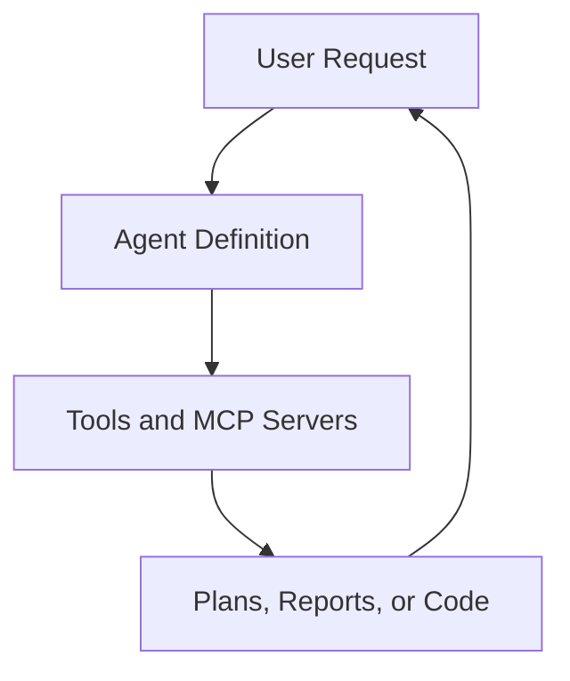

# AI Agents Guide

Global policy: /Users/4jp/AGENTS.md applies and cannot be overridden.

Complete guide to working with AI agents in the ivviiviivvi template.

---

## Overview

The AI framework includes **26+ production agents** designed for specialized tasks. Agents are markdown-based definitions that guide AI assistants (GitHub Copilot, Claude, etc.) for specific workflows.

### Agent Architecture

```
src/ai_framework/
├── agents/          # 26+ agent definitions
├── chatmodes/       # Conversation modes
├── instructions/    # 100+ coding instructions
├── prompts/         # Task-specific prompts
└── collections/     # Grouped resources
```

### How Agents Work



---

## Available Agents

### Security & Compliance

| Agent | Purpose |
|-------|---------|
| `security-audit.agent.md` | Comprehensive security audits |
| `jfrog-sec.agent.md` | JFrog security remediation |
| `stackhawk-security-onboarding.agent.md` | StackHawk security setup |
| `data-sanitization.agent.md` | PII and sensitive data cleanup |
| `data-forensics.agent.md` | Security incident investigation |

### Infrastructure & DevOps

| Agent | Purpose |
|-------|---------|
| `terraform.agent.md` | Terraform infrastructure management |
| `arm-migration.agent.md` | ARM architecture migration |
| `workflow-optimizer.agent.md` | GitHub Actions optimization |
| `repository-setup.agent.md` | New repository configuration |

### Database & Data

| Agent | Purpose |
|-------|---------|
| `neon-migration-specialist.agent.md` | Postgres migrations with Neon |
| `neon-optimization-analyzer.agent.md` | Query performance optimization |
| `data-decommissioning.agent.md` | Secure data removal |
| `data-reclamation.agent.md` | Data recovery and restoration |

### Incident Response

| Agent | Purpose |
|-------|---------|
| `pagerduty-incident-responder.agent.md` | PagerDuty incident analysis |
| `dynatrace-expert.agent.md` | Observability and debugging |

### Development Assistance

| Agent | Purpose |
|-------|---------|
| `csharp-expert.agent.md` | C# development assistance |
| `winforms-expert.agent.md` | WinForms application development |
| `adr-generator.agent.md` | Architecture Decision Records |
| `completionism-specialist.agent.md` | Ensuring completeness |

### Feature Management

| Agent | Purpose |
|-------|---------|
| `launchdarkly-flag-cleanup.agent.md` | Feature flag cleanup |
| `amplitude-experiment-implementation.agent.md` | A/B testing with Amplitude |

### Organization Management

| Agent | Purpose |
|-------|---------|
| `github-org-manager.agent.md` | GitHub organization management |
| `pr-branch-cleanup.agent.md` | Stale branch cleanup |
| `greener-grass-workflow-benchmark.agent.md` | Workflow benchmarking |

---

## How to Use Agents

### In GitHub Copilot

Reference agents in Copilot Chat:

```
@workspace Use the security-audit agent to analyze this repository
```

### In Claude Code

Reference agents via the AI framework:

```
Using the terraform agent from src/ai_framework/agents/terraform.agent.md,
help me create infrastructure for a new service.
```

### In Workflows

Invoke agents programmatically:

```yaml
- name: Run agent
  uses: ./.github/actions/run-agent
  with:
    agent: security-audit
    context: ${{ github.workspace }}
```

### Via MCP Servers

Some agents integrate with MCP (Model Context Protocol) servers:

```yaml
mcp-servers:
  terraform:
    type: 'local'
    command: 'docker'
    args: ['run', '-i', '--rm', 'hashicorp/terraform-mcp-server:latest']
```

---

## Agent Anatomy

### Schema

Agents follow a standard frontmatter schema:

```yaml
---
name: Agent Name
description: One-sentence purpose description.
tools:
  - tool_1
  - tool_2
tags:
  - category
  - domain
updated: YYYY-MM-DD
---
```

### Full Agent Example

```markdown
---
name: Security Audit
description: Performs comprehensive security audits of repositories and code.
tools:
  - read
  - search
  - edit
  - github/*
tags:
  - security
  - audit
  - compliance
updated: 2026-01-30
---

# Security Audit Agent

## Purpose

Perform comprehensive security audits of repositories, identifying
vulnerabilities, misconfigurations, and compliance issues.

## Capabilities

- Scan for exposed secrets and credentials
- Analyze dependency vulnerabilities
- Review access controls and permissions
- Check security configurations
- Generate compliance reports

## Workflow

1. **Discovery**: Identify all security-relevant files and configurations
2. **Analysis**: Scan for known vulnerability patterns
3. **Assessment**: Evaluate risk levels and impact
4. **Reporting**: Generate actionable findings report
5. **Remediation**: Suggest or implement fixes

## Usage

Invoke this agent when you need to:
- Audit repository security posture
- Prepare for compliance reviews
- Investigate security incidents
- Review security configurations

## Example Prompts

- "Perform a security audit of this repository"
- "Check for exposed secrets in the codebase"
- "Review our dependency security status"
- "Generate a security compliance report"

## Tools Used

- `read`: Read files and configurations
- `search`: Find patterns and vulnerabilities
- `github/security`: Access GitHub security features
- `bandit`: Python security scanning
- `trivy`: Container and dependency scanning

## Limitations

- Cannot access external systems without MCP integration
- Requires appropriate permissions for GitHub API access
- Some scans may require manual verification
```

---

## Creating Custom Agents

### Step 1: Create Agent File

Create a new file in `src/ai_framework/agents/`:

```bash
touch src/ai_framework/agents/my-custom.agent.md
```

### Step 2: Add Frontmatter

```yaml
---
name: My Custom Agent
description: Brief description of the agent's purpose.
tools:
  - read
  - search
  - edit
tags:
  - custom
  - your-domain
updated: 2026-01-30
---
```

### Step 3: Define Agent Content

```markdown
# My Custom Agent

## Purpose

[Explain what this agent does]

## Capabilities

- [Capability 1]
- [Capability 2]

## Workflow

1. [Step 1]
2. [Step 2]
3. [Step 3]

## Usage

[When and how to use this agent]

## Example Prompts

- "Example prompt 1"
- "Example prompt 2"
```

### Step 4: Regenerate Inventory

```bash
python src/automation/scripts/generate_agent_inventory.py
```

### Step 5: Test the Agent

Test with your AI assistant to verify behavior matches expectations.

---

## Agent Development Best Practices

### Do

- **Be specific**: Clear, focused agent purposes
- **Document thoroughly**: Include examples and use cases
- **List all tools**: Explicit tool requirements
- **Use standard tags**: For discoverability
- **Test regularly**: Verify agent behavior

### Avoid

- **Overly broad scope**: Agents should do one thing well
- **Embedding secrets**: Never include credentials
- **Vague descriptions**: Be precise about capabilities
- **Outdated information**: Keep agents current

### Naming Conventions

```
# File naming
lowercase-with-hyphens.agent.md

# Examples
security-audit.agent.md
terraform.agent.md
data-forensics.agent.md
```

---

## MCP Server Integration

Some agents integrate with MCP (Model Context Protocol) servers for enhanced capabilities:

### MCP Server Configuration

```yaml
mcp-servers:
  server-name:
    type: 'local'    # or 'http'
    command: 'docker'
    args: ['run', '-i', '--rm', 'image:tag']
    env:
      API_KEY: ${COPILOT_MCP_API_KEY}
    tools: ['*']     # or specific tool list
```

### Agents with MCP Integration

| Agent | MCP Server | Purpose |
|-------|-----------|---------|
| `terraform.agent.md` | terraform | HCP Terraform operations |
| `dynatrace-expert.agent.md` | dynatrace | Observability integration |
| `pagerduty-incident-responder.agent.md` | pagerduty | Incident management |
| `launchdarkly-flag-cleanup.agent.md` | launchdarkly | Feature flag management |
| `octopus-deploy-release-notes-mcp.agent.md` | octopus | Deployment automation |

---

## Related Resources

### Instructions

Located in `src/ai_framework/instructions/`, these provide coding guidelines:

- 100+ coding instructions
- Language-specific patterns
- Organization standards

### Prompts

Located in `src/ai_framework/prompts/`, these are task-specific templates:

- Code review prompts
- Documentation generation
- Refactoring guidance

### Chat Modes

Located in `src/ai_framework/chatmodes/`, these define conversation styles:

- Expert mode
- Beginner-friendly mode
- Domain-specific modes

---

## Troubleshooting

### Agent Not Found

```bash
# Verify file exists
ls src/ai_framework/agents/*.agent.md

# Check file naming
# Must end with .agent.md
```

### Tools Not Working

1. Verify tool is listed in agent's `tools` field
2. Check MCP server configuration if applicable
3. Ensure required permissions are granted

### MCP Connection Issues

1. Verify MCP server is running
2. Check environment variables
3. Review MCP server logs

---

## Next Steps

- **[Agent Schema](../../src/ai_framework/agents/SCHEMA.md)** - Frontmatter specification
- **[Development Guide](../../src/ai_framework/agents/DEVELOPMENT_GUIDE.md)** - Authoring guide
- **[Workflow Guide](WORKFLOWS.md)** - Workflow integration
- **[Architecture Overview](../architecture/OVERVIEW.md)** - System design
