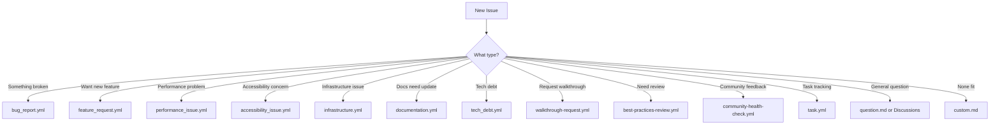

# Issue Templates Guide

> **Quick Reference:** How to use GitHub issue templates in this organization

## Overview

This repository provides **17 specialized issue templates** to streamline bug
reports, feature requests, and other contributions. Using the right template
ensures your issue contains the necessary information for quick triage and
resolution.

## Available Templates

### 🐛 Bug Reports

#### `bug_report.yml` ⭐ **Recommended**

- **Purpose:** Report bugs with structured fields
- **Use when:** Something isn't working as expected
- **Fields:** Environment, steps to reproduce, expected vs actual behavior
- **Auto-labels:** `bug`

#### `bug_report.md` (Legacy)

- **Purpose:** Markdown-based bug report
- **Use when:** You prefer freeform markdown
- **Status:** Deprecated - use `bug_report.yml` instead

### ✨ Enhancements

#### `feature_request.yml` ⭐ **Recommended**

- **Purpose:** Request new features with business case
- **Use when:** You want new functionality
- **Fields:** Problem statement, proposed solution, alternatives
- **Auto-labels:** `enhancement`

#### `feature_request.md` (Legacy)

- **Purpose:** Markdown-based feature request
- **Status:** Deprecated - use `feature_request.yml` instead

### 🔧 Specialized Issues

#### `accessibility_issue.yml`

- **Purpose:** Report accessibility concerns
- **Use when:** WCAG compliance issues, screen reader problems
- **Fields:** WCAG criteria, user impact, severity
- **Auto-labels:** `accessibility`, `a11y`

#### `best-practices-review.yml`

- **Purpose:** Request code or process review
- **Use when:** Seeking feedback on implementation approach
- **Fields:** Area to review, specific concerns, context
- **Auto-labels:** `review`, `best-practices`

#### `community-health-check.yml`

- **Purpose:** Provide community feedback
- **Use when:** Suggesting improvements to community processes
- **Fields:** Health metrics, concerns, suggestions
- **Auto-labels:** `community`

#### `infrastructure.yml`

- **Purpose:** Report infrastructure/deployment issues
- **Use when:** CI/CD, deployment, or infrastructure problems
- **Fields:** Environment, affected services, logs
- **Auto-labels:** `infrastructure`, `devops`

#### `performance_issue.yml`

- **Purpose:** Report performance problems
- **Use when:** Slowness, memory leaks, inefficiency
- **Fields:** Baseline metrics, current metrics, profiling data
- **Auto-labels:** `performance`, `optimization`

#### `tech_debt.yml`

- **Purpose:** Track technical debt
- **Use when:** Code needs refactoring or modernization
- **Fields:** Current state, proposed improvements, impact
- **Auto-labels:** `tech-debt`, `refactoring`

#### `walkthrough-request.yml`

- **Purpose:** Request interactive demo or tutorial
- **Use when:** You want a guided walkthrough created
- **Fields:** Topic, target audience, format preferences
- **Auto-labels:** `walkthrough`, `documentation`

### 📚 Documentation

#### `documentation.yml`

- **Purpose:** Request documentation improvements
- **Use when:** Docs are missing, unclear, or outdated
- **Fields:** Affected docs, what's missing, suggested improvements
- **Auto-labels:** `documentation`

#### `documentation.md` (Legacy)

- **Purpose:** Markdown-based documentation request
- **Status:** Deprecated - use `documentation.yml` instead

### 🎯 General

#### `task.yml`

- **Purpose:** Track general tasks
- **Use when:** Work item that doesn't fit other categories
- **Fields:** Description, acceptance criteria, dependencies
- **Auto-labels:** `task`

#### `question.md`

- **Purpose:** Ask questions
- **Use when:** You need help or clarification
- **Note:** Consider using GitHub Discussions instead
- **Auto-labels:** `question`

#### `custom.md`

- **Purpose:** Custom issue not fitting other templates
- **Use when:** None of the above templates apply
- **Note:** This is a fallback - try to use a specific template

## Template Selection Guide



## Best Practices

### DO ✅

- **Search first** - Check if your issue already exists
- **Use the right template** - Choose the most specific template
- **Fill all required fields** - Helps with quick triage
- **Provide context** - Include relevant details
- **Add labels** - Help categorize your issue (auto-applied by templates)
- **Link related issues** - Use `#issue-number` to reference

### DON'T ❌

- **Skip required fields** - Makes triage difficult
- **Create duplicates** - Search before creating
- **Mix multiple issues** - Create separate issues instead
- **Use vague titles** - Be specific and descriptive
- **Post sensitive data** - Remove secrets, PII, etc.

## For Template Maintainers

### Template Structure

All YAML templates follow this structure:

```yaml
name: Template Name
description: Brief description
title: "[CATEGORY] "
labels: ["label1", "label2"]
body:
  - type: markdown | input | textarea | dropdown | checkboxes
    attributes:
      label: Field Label
      description: Help text
      placeholder: Example value (optional)
    validations:
      required: true | false
```

### Validation Rules

- **Required fields:** User must fill before submitting
- **Dropdown fields:** Limit choices to predefined options
- **Checkbox fields:** Allow multiple selections
- **Input fields:** Single-line text
- **Textarea fields:** Multi-line text with optional placeholder

### Auto-applied Labels

Labels specified in template frontmatter are automatically applied when the
issue is created. This ensures consistent categorization.

### Updating Templates

When updating templates:

1. **Test changes** - Create test issues to verify functionality
1. **Update this guide** - Keep documentation in sync
1. **Announce changes** - Notify users of significant updates
1. **Version templates** - Consider adding version comments

## Related Resources

- **GitHub Discussions:** For questions and general discussion
- **Contributing Guide:** See `CONTRIBUTING.md`
- **Issue Triage Process:** See `docs/guides/issue-triage.md`
- **Label Guide:** See `docs/LABELS.md`

## Support

**Need help choosing a template?**

- Post in
  [GitHub Discussions](https://github.com/ivviiviivvi/.github/discussions)<!-- link:github.discussions -->
- Ask in the #help channel (if applicable)
- Use the `question.md` template

**Found a problem with a template?**

- Use `bug_report.yml` to report template issues
- Tag with `template-issue` label

______________________________________________________________________

**Last Updated:** 2026-01-15\
**Maintained by:** Documentation Team
