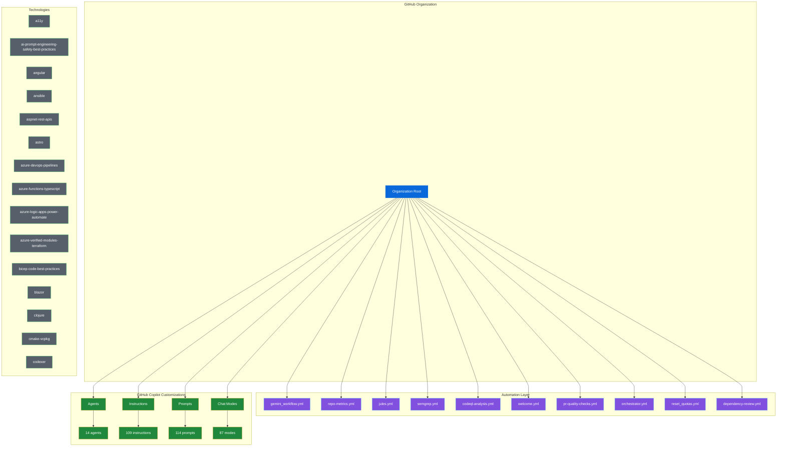

# 🎯 Organization Ecosystem Dashboard

**Last Updated**: 2025-11-16T13:11:03.971943
**Organization**: 

---

## 📋 Table of Contents

- [Quick Stats](#-quick-stats)
- [Repository Health](#-repository-health)
- [Link Health](#-link-health)
- [Alerts](#-alerts)
- [Ecosystem Map](#-ecosystem-map)
- [Technology Coverage](#-technology-coverage)
- [Active Workflows](#-active-workflows)

---

## 📊 Quick Stats

| Category | Count |
|----------|-------|
| GitHub Actions Workflows | 32 |
| Copilot Agents | 14 |
| Copilot Instructions | 109 |
| Copilot Prompts | 114 |
| Copilot Chat Modes | 87 |
| Technologies Supported | 109 |

[Back to Top](#organization-ecosystem-dashboard)

## ⚠️  Alerts

### 💥 Shatter Points (3)

🔴 **Missing Critical Workflow** (HIGH)
  - Critical workflow ci.yml not found
  - 💡 Implement ci.yml to ensure automated ci

🔴 **Missing Critical Workflow** (HIGH)
  - Critical workflow security-scan.yml not found
  - 💡 Implement security-scan.yml to ensure automated security-scan

🔴 **Missing Critical Workflow** (HIGH)
  - Critical workflow deployment.yml not found
  - 💡 Implement deployment.yml to ensure automated deployment

[Back to Top](#organization-ecosystem-dashboard)

## 🗺️  Ecosystem Map

[Back to Top](#organization-ecosystem-dashboard)

## 🛠️  Technology Coverage

Supported languages and frameworks:

View all 109 technologies

| `a11y` | `ai-prompt-engineering-safety-best-practices` | `angular` | `ansible` |
| --- | --- | --- | --- |
| `aspnet-rest-apis` | `astro` | `azure-devops-pipelines` | `azure-functions-typescript` |
| `azure-logic-apps-power-automate` | `azure-verified-modules-terraform` | `bicep-code-best-practices` | `blazor` |
| `clojure` | `cmake-vcpkg` | `codexer` | `coldfusion-cfc` |
| `coldfusion-cfm` | `collections` | `containerization-docker-best-practices` | `convert-jpa-to-spring-data-cosmos` |
| `copilot-thought-logging` | `csharp` | `csharp-ja` | `csharp-ko` |
| `csharp-mcp-server` | `dart-n-flutter` | `declarative-agents-microsoft365` | `devbox-image-definition` |
| `devops-core-principles` | `dotnet-architecture-good-practices` | `dotnet-framework` | `dotnet-maui` |
| `dotnet-upgrade` | `dotnet-wpf` | `genaiscript` | `generate-modern-terraform-code-for-azure` |
| `gilfoyle-code-review` | `github-actions-ci-cd-best-practices` | `go` | `go-mcp-server` |
| `instructions` | `java` | `java-11-to-java-17-upgrade` | `java-17-to-java-21-upgrade` |
| `java-21-to-java-25-upgrade` | `java-mcp-server` | `joyride-user-project` | `joyride-workspace-automation` |
| `kotlin-mcp-server` | `kubernetes-deployment-best-practices` | `langchain-python` | `localization` |
| `markdown` | `memory-bank` | `mongo-dba` | `ms-sql-dba` |
| `nestjs` | `nextjs` | `nextjs-tailwind` | `nodejs-javascript-vitest` |
| `object-calisthenics` | `oqtane` | `performance-optimization` | `php-mcp-server` |
| `playwright-python` | `playwright-typescript` | `power-apps-canvas-yaml` | `power-apps-code-apps` |
| `power-bi-custom-visuals-development` | `power-bi-data-modeling-best-practices` | `power-bi-dax-best-practices` | `power-bi-devops-alm-best-practices` |
| `power-bi-report-design-best-practices` | `power-bi-security-rls-best-practices` | `power-platform-connector` | `power-platform-mcp-development` |
| `powershell` | `powershell-pester-5` | `prompt` | `python` |
| `python-mcp-server` | `quarkus` | `quarkus-mcp-server-sse` | `r` |
| `reactjs` | `ruby-mcp-server` | `ruby-on-rails` | `rust` |
| `rust-mcp-server` | `security-and-owasp` | `self-explanatory-code-commenting` | `shell` |
| `spec-driven-workflow-v1` | `springboot` | `sql-sp-generation` | `svelte` |
| `swift-mcp-server` | `taming-copilot` | `tanstack-start-shadcn-tailwind` | `task-implementation` |
| `tasksync` | `terraform` | `terraform-azure` | `terraform-sap-btp` |
| `typescript-5-es2022` | `typescript-mcp-server` | `update-code-from-shorthand` | `vuejs3` |
| `wordpress` |  |  |  |

[Back to Top](#organization-ecosystem-dashboard)

## ⚙️  Active Workflows

View all 32 workflows

- `accessibility-testing.yml`
- `auto-assign.yml`
- `auto-labeler.yml`
- `ci-advanced.yml`
- `claude-code-review.yml`
- `code-coverage.yml`
- `codeql-analysis.yml`
- `commit-tracking.yml`
- `community-health.yml`
- `dependency-review.yml`
- `gemini_workflow.yml`
- `grok_workflow.yml`
- `jules.yml`
- `link-checker.yml`
- `manual_reset.yml`
- `mutation-testing.yml`
- `openai_workflow.yml`
- `orchestrator.yml`
- `org-health-crawler.yml`
- `performance-benchmark.yml`
- `perplexity_workflow.yml`
- `pr-quality-checks.yml`
- `process_queue.yml`
- `release.yml`
- `repo-metrics.yml`
- `reset_quotas.yml`
- `sbom-generation.yml`
- `semantic-release.yml`
- `semgrep.yml`
- `version-bump.yml`
- `weekly-commit-report.yml`
- `welcome.yml`

[Back to Top](#organization-ecosystem-dashboard)

---

*Dashboard generated by Ecosystem Visualizer*
