```mermaid
graph TD
    %% Styles
    classDef org fill:#0969da,stroke:#0969da,color:#fff,stroke-width:2px;
    classDef workflow fill:#8250df,stroke:#54aeff,color:#fff,stroke-width:1px;
    classDef agent fill:#1a7f37,stroke:#d4a72c,color:#fff,stroke-width:1px;
    classDef tech fill:#57606a,stroke:#4ac26b,color:#fff,stroke-width:1px;

    subgraph "GitHub Organization"
        ORG[Organization Root]:::org
    end

    subgraph "Automation Layer"
        WF0[workflow-0.yml]:::workflow
        click WF0 "../.github/workflows/workflow-0.yml" "View Workflow"
        ORG --> WF0
        WF1[workflow-1.yml]:::workflow
        click WF1 "../.github/workflows/workflow-1.yml" "View Workflow"
        ORG --> WF1
        WF2[workflow-2.yml]:::workflow
        click WF2 "../.github/workflows/workflow-2.yml" "View Workflow"
        ORG --> WF2
        WF3[workflow-3.yml]:::workflow
        click WF3 "../.github/workflows/workflow-3.yml" "View Workflow"
        ORG --> WF3
        WF4[workflow-4.yml]:::workflow
        click WF4 "../.github/workflows/workflow-4.yml" "View Workflow"
        ORG --> WF4
        WF5[workflow-5.yml]:::workflow
        click WF5 "../.github/workflows/workflow-5.yml" "View Workflow"
        ORG --> WF5
        WF6[workflow-6.yml]:::workflow
        click WF6 "../.github/workflows/workflow-6.yml" "View Workflow"
        ORG --> WF6
        WF7[workflow-7.yml]:::workflow
        click WF7 "../.github/workflows/workflow-7.yml" "View Workflow"
        ORG --> WF7
        WF8[workflow-8.yml]:::workflow
        click WF8 "../.github/workflows/workflow-8.yml" "View Workflow"
        ORG --> WF8
        WF9[workflow-9.yml]:::workflow
        click WF9 "../.github/workflows/workflow-9.yml" "View Workflow"
        ORG --> WF9
    end

    subgraph "GitHub Copilot Customizations"
    end

    subgraph "Technologies"
        TECH0[python]:::tech
    end
```

# 🎯 Organization Ecosystem Dashboard

**Last Updated**: December 25, 2025 at 02:37 AM
**Organization**: TestOrg

---

## 📋 Table of Contents

- [Quick Stats](#-quick-stats)
- [Repository Health](#-repository-health)
- [Link Health](#-link-health)
- [Alerts](#--alerts)
- [Ecosystem Map](#--ecosystem-map)
- [Technology Coverage](#--technology-coverage)
- [Active Workflows](#--active-workflows)

---

## 📊 Quick Stats

| Category | Count |
|----------|-------|
| ⚡ GitHub Actions Workflows | 15 |
| 🤖 Copilot Agents | 0 |
| 📝 Copilot Instructions | 0 |
| 💬 Copilot Prompts | 0 |
| 🎭 Copilot Chat Modes | 0 |
| 🛠️  Technologies Supported | 1 |

[Back to Top](#-organization-ecosystem-dashboard)

## 🏥 Repository Health

⚠️ **Data Unavailable**: No data available

[Back to Top](#-organization-ecosystem-dashboard)

## 🔗 Link Health

ℹ️ **No Data**: External link validation was skipped or found no links.

[Back to Top](#-organization-ecosystem-dashboard)

## ⚠️  Alerts

✅ No alerts found! The ecosystem is healthy.

[Back to Top](#-organization-ecosystem-dashboard)

## 🗺️  Ecosystem Map

ℹ️  *The diagram below displays the first 10 workflows for readability. All 15 workflows are listed in the [Active Workflows](#-active-workflows) section.*

[Back to Top](#-organization-ecosystem-dashboard)

## 🛠️  Technology Coverage

Supported languages and frameworks:

View all 1 technologies

| `python` |  |  |  |
| --- | --- | --- | --- |

[Back to Top](#-organization-ecosystem-dashboard)

## ⚙️  Active Workflows

View all 15 workflows

- [`workflow-0.yml`](../.github/workflows/workflow-0.yml)
- [`workflow-1.yml`](../.github/workflows/workflow-1.yml)
- [`workflow-10.yml`](../.github/workflows/workflow-10.yml)
- [`workflow-11.yml`](../.github/workflows/workflow-11.yml)
- [`workflow-12.yml`](../.github/workflows/workflow-12.yml)
- [`workflow-13.yml`](../.github/workflows/workflow-13.yml)
- [`workflow-14.yml`](../.github/workflows/workflow-14.yml)
- [`workflow-2.yml`](../.github/workflows/workflow-2.yml)
- [`workflow-3.yml`](../.github/workflows/workflow-3.yml)
- [`workflow-4.yml`](../.github/workflows/workflow-4.yml)
- [`workflow-5.yml`](../.github/workflows/workflow-5.yml)
- [`workflow-6.yml`](../.github/workflows/workflow-6.yml)
- [`workflow-7.yml`](../.github/workflows/workflow-7.yml)
- [`workflow-8.yml`](../.github/workflows/workflow-8.yml)
- [`workflow-9.yml`](../.github/workflows/workflow-9.yml)

[Back to Top](#-organization-ecosystem-dashboard)

---

*Dashboard generated by Ecosystem Visualizer*
