```mermaid
graph TD
    %% Styles
    classDef org fill:#0969da,stroke:#0969da,color:#fff,stroke-width:2px;
    classDef workflow fill:#8250df,stroke:#54aeff,color:#fff,stroke-width:1px;
    classDef agent fill:#1a7f37,stroke:#d4a72c,color:#fff,stroke-width:1px;
    classDef tech fill:#57606a,stroke:#4ac26b,color:#fff,stroke-width:1px;

    subgraph "GitHub Organization"
        ORG[Organization Root]:::org
    end

    subgraph "Automation Layer"
        WF0[workflow-0.yml]:::workflow
        click WF0 "../.github/workflows/workflow-0.yml" "View Workflow"
        ORG --> WF0
        WF1[workflow-1.yml]:::workflow
        click WF1 "../.github/workflows/workflow-1.yml" "View Workflow"
        ORG --> WF1
        WF2[workflow-2.yml]:::workflow
        click WF2 "../.github/workflows/workflow-2.yml" "View Workflow"
        ORG --> WF2
        WF3[workflow-3.yml]:::workflow
        click WF3 "../.github/workflows/workflow-3.yml" "View Workflow"
        ORG --> WF3
        WF4[workflow-4.yml]:::workflow
        click WF4 "../.github/workflows/workflow-4.yml" "View Workflow"
        ORG --> WF4
        WF5[workflow-5.yml]:::workflow
        click WF5 "../.github/workflows/workflow-5.yml" "View Workflow"
        ORG --> WF5
        WF6[workflow-6.yml]:::workflow
        click WF6 "../.github/workflows/workflow-6.yml" "View Workflow"
        ORG --> WF6
        WF7[workflow-7.yml]:::workflow
        click WF7 "../.github/workflows/workflow-7.yml" "View Workflow"
        ORG --> WF7
        WF8[workflow-8.yml]:::workflow
        click WF8 "../.github/workflows/workflow-8.yml" "View Workflow"
        ORG --> WF8
        WF9[workflow-9.yml]:::workflow
        click WF9 "../.github/workflows/workflow-9.yml" "View Workflow"
        ORG --> WF9
    end

    subgraph "GitHub Copilot Customizations"
    end

    subgraph "Technologies"
        TECH0[python]:::tech
    end
```

# 🎯 Organization Ecosystem Dashboard

**Last Updated**: December 25, 2025 at 02:37 AM
**Organization**: TestOrg

---

## 📋 Table of Contents

- [Quick Stats](#-quick-stats)
- [Repository Health](#-repository-health)
- [Link Health](#-link-health)
- [Alerts](#-alerts)
- [Ecosystem Map](#-ecosystem-map)
- [Technology Coverage](#-technology-coverage)
- [Active Workflows](#-active-workflows)

---

## 📊 Quick Stats

| Category | Count |
|----------|-------|
| ⚡ GitHub Actions Workflows | 15 |
| 🤖 Copilot Agents | 0 |
| 📝 Copilot Instructions | 0 |
| 💬 Copilot Prompts | 0 |
| 🎭 Copilot Chat Modes | 0 |
| 🛠️  Technologies Supported | 1 |

[Back to Top](#organization-ecosystem-dashboard)

## 🏥 Repository Health

⚠️ **Data Unavailable**: No data available

[Back to Top](#organization-ecosystem-dashboard)

## 🔗 Link Health

ℹ️ **No Data**: External link validation was skipped or found no links.

[Back to Top](#organization-ecosystem-dashboard)

## ⚠️  Alerts

✅ No alerts found! The ecosystem is healthy.

[Back to Top](#organization-ecosystem-dashboard)

## 🗺️  Ecosystem Map

ℹ️  *The diagram below displays the first 10 workflows for readability. All 15 workflows are listed in the [Active Workflows](#-active-workflows) section.*

[Back to Top](#organization-ecosystem-dashboard)

## 🛠️  Technology Coverage

Supported languages and frameworks:

- `python`

[Back to Top](#organization-ecosystem-dashboard)

## ⚙️  Active Workflows

View all 15 workflows

**Legend:** 🛡️ Safeguard | 🔐 Security | ♻️ Reusable | 🤖 AI/Agent | 🚀 CI/CD | 🔀 PR | ⏱️ Scheduled | 💓 Health | ⚙️ Other

> **Legend:** 🛡️ Safeguard | 🔐 Security | ♻️ Reusable | 🤖 AI Agent | 🚀 CI/CD | 🔀 PR Mgmt | ⏱️ Scheduled | 💓 Health | ⚙️ General

| # | Type | Workflow | Action |
|---|---|---|---|
| 1 | ⚙️ | `workflow-0.yml` | [View](../.github/workflows/workflow-0.yml) |
| 2 | ⚙️ | `workflow-1.yml` | [View](../.github/workflows/workflow-1.yml) |
| 3 | ⚙️ | `workflow-10.yml` | [View](../.github/workflows/workflow-10.yml) |
| 4 | ⚙️ | `workflow-11.yml` | [View](../.github/workflows/workflow-11.yml) |
| 5 | ⚙️ | `workflow-12.yml` | [View](../.github/workflows/workflow-12.yml) |
| 6 | ⚙️ | `workflow-13.yml` | [View](../.github/workflows/workflow-13.yml) |
| 7 | ⚙️ | `workflow-14.yml` | [View](../.github/workflows/workflow-14.yml) |
| 8 | ⚙️ | `workflow-2.yml` | [View](../.github/workflows/workflow-2.yml) |
| 9 | ⚙️ | `workflow-3.yml` | [View](../.github/workflows/workflow-3.yml) |
| 10 | ⚙️ | `workflow-4.yml` | [View](../.github/workflows/workflow-4.yml) |
| 11 | ⚙️ | `workflow-5.yml` | [View](../.github/workflows/workflow-5.yml) |
| 12 | ⚙️ | `workflow-6.yml` | [View](../.github/workflows/workflow-6.yml) |
| 13 | ⚙️ | `workflow-7.yml` | [View](../.github/workflows/workflow-7.yml) |
| 14 | ⚙️ | `workflow-8.yml` | [View](../.github/workflows/workflow-8.yml) |
| 15 | ⚙️ | `workflow-9.yml` | [View](../.github/workflows/workflow-9.yml) |
### 🛡️ Safeguards & Policies

| Workflow | Action |
|---|---|
| `safeguard-5-secret-scanning.yml` | [View](../.github/workflows/safeguard-5-secret-scanning.yml) |
| `safeguard-6-admin-approval.yml` | [View](../.github/workflows/safeguard-6-admin-approval.yml) |
| `safeguard-7-staggered-scheduling.yml` | [View](../.github/workflows/safeguard-7-staggered-scheduling.yml) |
| `safeguard-8-usage-monitoring.yml` | [View](../.github/workflows/safeguard-8-usage-monitoring.yml) |

### 🔐 Security

| Workflow | Action |
|---|---|
| `codeql-analysis.yml` | [View](../.github/workflows/codeql-analysis.yml) |
| `reusable-security-scan.yml` | [View](../.github/workflows/reusable-security-scan.yml) |
| `scan-for-secrets.yml` | [View](../.github/workflows/scan-for-secrets.yml) |
| `security-scan.yml` | [View](../.github/workflows/security-scan.yml) |
| `semgrep.yml` | [View](../.github/workflows/semgrep.yml) |

### ♻️ Reusable Workflows

| Workflow | Action |
|---|---|
| `reusable-api-retry.yml` | [View](../.github/workflows/reusable-api-retry.yml) |
| `reusable-app-detect.yml` | [View](../.github/workflows/reusable-app-detect.yml) |
| `reusable-notify.yml` | [View](../.github/workflows/reusable-notify.yml) |

### 🤖 AI Agents & Automation

| Workflow | Action |
|---|---|
| `agentsphere-deployment.yml` | [View](../.github/workflows/agentsphere-deployment.yml) |
| `claude-code-review.yml` | [View](../.github/workflows/claude-code-review.yml) |
| `claude.yml` | [View](../.github/workflows/claude.yml) |
| `gemini-dispatch.yml` | [View](../.github/workflows/gemini-dispatch.yml) |
| `gemini-invoke.yml` | [View](../.github/workflows/gemini-invoke.yml) |
| `gemini-review.yml` | [View](../.github/workflows/gemini-review.yml) |
| `gemini-scheduled-triage.yml` | [View](../.github/workflows/gemini-scheduled-triage.yml) |
| `gemini-triage.yml` | [View](../.github/workflows/gemini-triage.yml) |
| `gemini_workflow.yml` | [View](../.github/workflows/gemini_workflow.yml) |
| `grok_workflow.yml` | [View](../.github/workflows/grok_workflow.yml) |
| `jules.yml` | [View](../.github/workflows/jules.yml) |
| `openai_workflow.yml` | [View](../.github/workflows/openai_workflow.yml) |
| `perplexity_workflow.yml` | [View](../.github/workflows/perplexity_workflow.yml) |

### 🚀 CI/CD & Deployment

| Workflow | Action |
|---|---|
| `accessibility-testing.yml` | [View](../.github/workflows/accessibility-testing.yml) |
| `build-pages-site.yml` | [View](../.github/workflows/build-pages-site.yml) |
| `ci-advanced.yml` | [View](../.github/workflows/ci-advanced.yml) |
| `ci.yml` | [View](../.github/workflows/ci.yml) |
| `collect-deployment-metadata.yml` | [View](../.github/workflows/collect-deployment-metadata.yml) |
| `deploy-to-pages-live.yml` | [View](../.github/workflows/deploy-to-pages-live.yml) |
| `deployment.yml` | [View](../.github/workflows/deployment.yml) |
| `docker-build-push.yml` | [View](../.github/workflows/docker-build-push.yml) |
| `mutation-testing.yml` | [View](../.github/workflows/mutation-testing.yml) |
| `reconcile-deployments.yml` | [View](../.github/workflows/reconcile-deployments.yml) |
| `release.yml` | [View](../.github/workflows/release.yml) |
| `semantic-release.yml` | [View](../.github/workflows/semantic-release.yml) |

### 🔀 PR Management

| Workflow | Action |
|---|---|
| `auto-enable-merge.yml` | [View](../.github/workflows/auto-enable-merge.yml) |
| `auto-merge.yml` | [View](../.github/workflows/auto-merge.yml) |
| `auto-pr-create.yml` | [View](../.github/workflows/auto-pr-create.yml) |
| `batch-pr-lifecycle.yml` | [View](../.github/workflows/batch-pr-lifecycle.yml) |
| `pr-batch-merge.yml` | [View](../.github/workflows/pr-batch-merge.yml) |
| `pr-consolidation.yml` | [View](../.github/workflows/pr-consolidation.yml) |
| `pr-quality-checks.yml` | [View](../.github/workflows/pr-quality-checks.yml) |
| `pr-suggestion-implementation.yml` | [View](../.github/workflows/pr-suggestion-implementation.yml) |
| `pr-task-catcher.yml` | [View](../.github/workflows/pr-task-catcher.yml) |

### ⏱️ Scheduled Tasks

| Workflow | Action |
|---|---|
| `scheduled-walkthrough-generator.yml` | [View](../.github/workflows/scheduled-walkthrough-generator.yml) |
| `weekly-commit-report.yml` | [View](../.github/workflows/weekly-commit-report.yml) |

### 💓 Health & Metrics

| Workflow | Action |
|---|---|
| `admin-approval-dashboard.yml` | [View](../.github/workflows/admin-approval-dashboard.yml) |
| `community-health.yml` | [View](../.github/workflows/community-health.yml) |
| `health-check-live-apps.yml` | [View](../.github/workflows/health-check-live-apps.yml) |
| `health-check.yml` | [View](../.github/workflows/health-check.yml) |
| `link-checker.yml` | [View](../.github/workflows/link-checker.yml) |
| `metrics-collection.yml` | [View](../.github/workflows/metrics-collection.yml) |
| `metrics-dashboard.yml` | [View](../.github/workflows/metrics-dashboard.yml) |
| `org-health-crawler.yml` | [View](../.github/workflows/org-health-crawler.yml) |
| `repo-metrics.yml` | [View](../.github/workflows/repo-metrics.yml) |
| `usage-monitoring.yml` | [View](../.github/workflows/usage-monitoring.yml) |

### ⚙️ Utility & Other

| Workflow | Action |
|---|---|
| `alert-on-workflow-failure.yml` | [View](../.github/workflows/alert-on-workflow-failure.yml) |
| `auto-assign.yml` | [View](../.github/workflows/auto-assign.yml) |
| `auto-labeler.yml` | [View](../.github/workflows/auto-labeler.yml) |
| `badge-management.yml` | [View](../.github/workflows/badge-management.yml) |
| `bio-description-completions.yml` | [View](../.github/workflows/bio-description-completions.yml) |
| `branch-cleanup-notify.yml` | [View](../.github/workflows/branch-cleanup-notify.yml) |
| `branch-lifecycle-management.yml` | [View](../.github/workflows/branch-lifecycle-management.yml) |
| `branch-lifecycle.yml` | [View](../.github/workflows/branch-lifecycle.yml) |
| `code-coverage.yml` | [View](../.github/workflows/code-coverage.yml) |
| `combine-prs.yml` | [View](../.github/workflows/combine-prs.yml) |
| `commit-tracking.yml` | [View](../.github/workflows/commit-tracking.yml) |
| `create-organizational-content.yml` | [View](../.github/workflows/create-organizational-content.yml) |
| `dependency-review.yml` | [View](../.github/workflows/dependency-review.yml) |
| `draft-to-ready-automation.yml` | [View](../.github/workflows/draft-to-ready-automation.yml) |
| `generate-pages-index.yml` | [View](../.github/workflows/generate-pages-index.yml) |
| `generate-walkthrough.yml` | [View](../.github/workflows/generate-walkthrough.yml) |
| `manual_reset.yml` | [View](../.github/workflows/manual_reset.yml) |
| `orchestrator.yml` | [View](../.github/workflows/orchestrator.yml) |
| `org-walkthrough-generator.yml` | [View](../.github/workflows/org-walkthrough-generator.yml) |
| `org-wide-workflow-dispatch.yml` | [View](../.github/workflows/org-wide-workflow-dispatch.yml) |
| `performance-benchmark.yml` | [View](../.github/workflows/performance-benchmark.yml) |
| `process_queue.yml` | [View](../.github/workflows/process_queue.yml) |
| `project-automation.yml` | [View](../.github/workflows/project-automation.yml) |
| `repository-bootstrap.yml` | [View](../.github/workflows/repository-bootstrap.yml) |
| `reset_quotas.yml` | [View](../.github/workflows/reset_quotas.yml) |
| `sbom-generation.yml` | [View](../.github/workflows/sbom-generation.yml) |
| `staggered-scheduling.yml` | [View](../.github/workflows/staggered-scheduling.yml) |
| `task-extraction.yml` | [View](../.github/workflows/task-extraction.yml) |
| `validate-quality.yml` | [View](../.github/workflows/validate-quality.yml) |
| `version-bump.yml` | [View](../.github/workflows/version-bump.yml) |
| `version-control-standards.yml` | [View](../.github/workflows/version-control-standards.yml) |
| `welcome.yml` | [View](../.github/workflows/welcome.yml) |

[Back to Top](#organization-ecosystem-dashboard)

---

*Dashboard generated by Ecosystem Visualizer*
