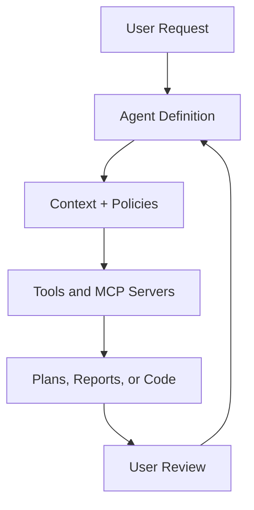
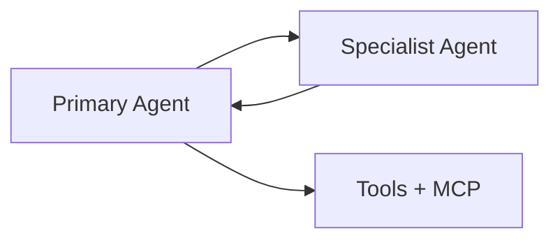

# Agent Interaction Diagrams

## Agent Runtime Flow

```mermaid
graph TD
  User[User Request] --> Agent[Agent Definition]
  Agent --> Context[Context + Policies]
  Context --> Tools[Tools and MCP Servers]
  Tools --> Outputs[Plans, Reports, or Code]
  Outputs --> Review[User Review]
  Review --> Agent
```

## Agent Collaboration (Optional)

```mermaid
graph LR
  Primary[Primary Agent] --> Specialist[Specialist Agent]
  Specialist --> Primary
  Primary --> Tools[Tools + MCP]
```
